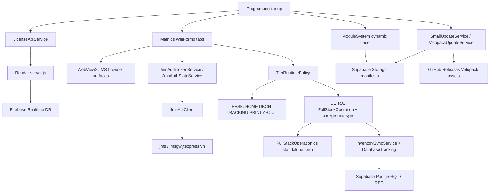

# Current Architecture

## Current Verified Baseline

Verified from source files in this checkout.



Hard rules from current code:

- `FullStackOperation` is not a tab. It is a separate form gated by `TierRuntimePolicy.EnableFullStackOperation`.
- BASE gets manual tabs only and must not start startup inventory sync, database tracking, auto-sync timer, or FullStack realtime.
- Major update is user-triggered from the About tab through `VelopackUpdateService`.
- Small selector/runtime config update can auto-apply through `SmallUpdateService` and selector-update manifest.
- WebView2 access must be marshalled to UI thread; code already has `UiThread` and UI-thread checks in several paths.
- JMS auth token is a 32-character hex token, not the license JWT.

Current verification gaps:

- `supabase-migration.sql` does not define the waybill tables/RPCs used by `SupabaseDbService`; database schema is `NEED VERIFY`.
- Module signature enforcement is inconsistent; module supply-chain trust is `NEED VERIFY`.
- Historical clean-checkout build blocker from missing root `modules/*.json` was fixed with conditional content includes in `src/AutoJMS/AutoJMS.csproj`; latest recorded Debug build succeeded with warnings only.

## Architecture Layers

```
┌─────────────────────────────────────────────────────┐
│                   UI Layer (WinForms)               │
│  Main.cs (TabControl)  │  FullStackOperation.cs    │
│  frmLogin.cs           │  (ULTRA only)              │
├─────────────────────────────────────────────────────┤
│                 Service Layer                       │
│  LicenseApiService    │  JmsApiClient              │
│  JmsAuthTokenService │  InventorySyncService     │
│  VelopackUpdateService│  SmallUpdateService       │
│  MajorUpdateService   │  HashVerifier             │
│  SupabaseDbService   │  GoogleSheetService       │
│  DkchManager         │  PrintService             │
│  ZaloChatService     │  WaybillTrackingService  │
├─────────────────────────────────────────────────────┤
│              Module System Layer                    │
│  ModuleStartup │ ModuleRegistry │ SupabaseModuleProvider│
├─────────────────────────────────────────────────────┤
│              Infrastructure Layer                    │
│  AppPaths │ AppConfig │ AppLogger │ SecureConfigCrypto│
│  TierRuntimePolicy │ TierDefinitions │ SupabaseModels│
├─────────────────────────────────────────────────────┤
│              External Services                      │
│  JMS (jms.jtexpress.vn) via WebView2 + HTTP API   │
│  Render License Server (autojms-api.onrender.com)  │
│  Firebase Realtime Database (keyauthjms)            │
│  Supabase PostgreSQL + Storage (valmbajjpkjccqslsuou)│
│  GitHub Releases (Datt03-sss/AutoJMS-Update)     │
└─────────────────────────────────────────────────────┘
```

## Entry Points

### Program.cs
- Velopack init: `VelopackApp.Build().Run()`
- DPI aware setup
- Anti-debugger check (release only)
- HWID computation (SMBIOS UUID + disk serial + MachineGuid)
- License verification (online-first, offline fallback)
- Service initialization from license response
- Module system init
- MainForm launch with tier parameter

### Main.cs Constructor
1. Resolve TierRuntimePolicy from tier name
2. Initialize WebView2 creation properties (shared BrowserData folder)
3. Register all tabs with TabManager
4. Apply tier restrictions
5. Setup WebView2 instances
6. Start auto-sync timer (ULTRA only)
7. Initialize DkchManager

### Main.OnLoad
1. Initialize network monitor
2. Ensure WebView2 instances ready
3. Navigate to JMS home URL on all WebViews
4. Setup tracking/print services
5. Initialize DkchManager daemon
6. WebViewHost init
7. Refresh auth token
8. Validate stored token
9. Run startup sync (ULTRA only)

### Main.OnShown
1. Pre-create FullStackOperation in background (ULTRA only)
2. Not shown until user types "DASH" in URL bar

## Auth Architecture

### Two Token Types

| Token | Source | Purpose | Format |
|-------|--------|---------|--------|
| License JWT | Render server | License activation, heartbeat | JWT (RS256) |
| JMS AuthToken | JMS WebView2 localStorage | JMS API calls | 32-char hex |

### JMS AuthToken Flow

```
WebView2 Navigation
    ↓
CoreWebView2_WebResourceRequested (header capture)
    OR
RefreshAuthTokenAsync (JS injection)
    ↓
ApplyCapturedToken (validate: not JWT, 32 hex)
    ↓
JmsAuthStateService.SetToken()
JmsAuthTokenService.ApplyToken()
AuthStateService.Instance.SetToken()
Main.CapturedAuthToken
SettingsManager (debounced save to AutoJMS.json)
```

### Token Priority (JmsAuthTokenService.ResolveTokenAsync)

1. **In-memory**: JmsAuthStateService.CurrentToken
2. **WebView2**: RefreshAuthTokenAsync (jms origin only)
3. **Config**: _settings.LastAuthToken from AutoJMS.json

### 401 Handling (JmsApiClient.PostJsonAsync)

1. Attempt API call with current token
2. On 401: ForceRefreshFromWebViewAsync → retry once
3. If still 401: NotifyReallyExpired → clear token, stop background jobs
4. **DO NOT clear token immediately** — WebView session may still be valid

## Tier Architecture

### TierRuntimePolicy

Single source of truth for what each tier can run.

```
TierRuntimePolicy.Resolve(tier)
    ↓
Check tier-definitions.json for FULLSTACK_OPERATION form
    ↓
Return policy object with flags:
  - EnableStartupInventorySync
  - EnableStartupDatabaseTracking
  - EnableBackgroundAutoSync
  - EnableFullStackOperation
  - AllowManualTracking
  - AllowManualPrint
```

### BASE Tier

| Feature | Allowed |
|---------|---------|
| HOME tab | ✓ |
| DKCH tab | ✓ |
| TRACKING tab (manual) | ✓ |
| PRINT tab | ✓ |
| ABOUT tab | ✓ |
| Auto inventory sync | ✗ |
| Auto database tracking | ✗ |
| Background sync timer | ✗ |
| FullStackOperation form | ✗ |

### ULTRA Tier

| Feature | Allowed |
|---------|---------|
| All BASE features | ✓ |
| FullStackOperation form | ✓ |
| Auto inventory sync | ✓ |
| Auto database tracking | ✓ |
| Background sync timer | ✓ |

## Data Flow

### Waybill Tracking (Manual)

```
User input waybill → NormalizeWaybillInput
    ↓
WaybillTrackingService.SearchTrackingAsync
    ↓
JmsApiClient.PostJsonAsync (with authToken, 401 retry)
    ↓
Parse response → DataTable → tabTracking_dataView
```

### DKCH Automation

```
User clicks DKCH1/DKCH2 → DkchManager.StartAsync
    ↓
WebViewAutomation (Vue/Element UI selectors)
    ↓
Fill form → Submit → Wait for API response
    ↓
On completion: Add to done list, update tracking history
```

### Inventory Sync (ULTRA only)

```
_autoSyncTimer tick (every 30 min, 8AM-11:30PM)
    OR
RunStartupSyncAsync
    ↓
SupabaseDbService.TryAcquireInventoryLease (30 min lock)
    ↓
InventorySyncService.FetchAllInventoryWaybillsWithRetryAsync
    ↓
SupabaseDbService.UpsertNewWaybillsOnlyAsync
    ↓
DatabaseTracking.RunBackgroundTrackingAsync
    ↓
ReleaseInventoryLease
```

### Print Flow

```
User selects waybills → ExecutePrintAsync
    ↓
GetPdfUrlViaCSharpAsync (JMS API with authToken)
    ↓
DownloadPdfWithRetryAsync
    ↓
PdfiumViewer → PrintDocument → System printer
    ↓
SavePrintLog (keep 3 days)
```

## Path Architecture

### Install Layout (Velopack)

```
C:\AutoJMS\                    ← InstallRoot (user-chosen)
├── current\                    ← Velopack-managed binaries
│   └── AutoJMS.exe            ← AppContext.BaseDirectory
├── packages\                  ← Velopack .nupkg cache
├── AppData\                   ← UserDataDir (writable)
│   ├── AutoJMS.json          ← User settings
│   ├── secure\
│   │   └── AutoJMS.secure    ← Encrypted config
│   ├── cache\
│   ├── logs\
│   │   └── debug.log
│   ├── BrowserData\          ← Shared WebView2 data
│   ├── Downloads\
│   │   └── Vận đơn đã in\   ← Printed PDFs
│   └── ZaloProfile\
└── AutoJMS.exe                ← Velopack stub launcher
```

### Key Paths (AppPaths.cs)

| Path | Value |
|------|-------|
| InstallDir | AppContext.BaseDirectory (usually `...\current`) |
| InstallRoot | Parent of InstallDir (user-chosen root) |
| UserDataDir | InstallRoot\AppData |
| AutoJmsJson | UserDataDir\AutoJMS.json |
| SecureFile | UserDataDir\secure\AutoJMS.secure |
| DebugLogFile | UserDataDir\logs\debug.log |

## Update Architecture

### Two Update Types

| Type | Mechanism | Trigger | Binary Source |
|------|----------|---------|---------------|
| Small Update | SmallUpdateService | Auto after license | Supabase Storage |
| Major Update | VelopackUpdateService | Manual (About tab) | GitHub Releases |

### Major Update Flow

```
tabAbout_btnCheckUpdate_Click
    ↓
VelopackUpdateService.CheckAndUpdateAsync
    ↓
SupabaseManifestService.FetchVersionLatestAsync
    ↓
Read version-latest.json → provider=github
    ↓
Velopack GithubSource → Check GitHub Releases API
    ↓
User confirms → Download → PrepareForUpdateAsync
    ↓
ApplyUpdatesAndRestart (Velopack)
```

### version-latest.json Structure

```json
{
  "schemaVersion": 1,
  "channels": {
    "stable": {
      "version": "1.26.6",
      "displayVersion": "1.26.6",
      "internalBuild": "1.26.6.0",
      "velopackChannel": "stable",
      "provider": "github",
      "githubRepo": "Datt03-sss/AutoJMS-Update",
      "tag": "v1.26.6-Release",
      "prerelease": false
    }
  }
}
```

## Service Initialization

### At License Verification (Program.cs)

```
VerifyResult → InitializeServicesFromLicense
    ↓
1. SupabaseManifestService (from supabaseBaseUrl + manifests)
2. RuntimeConfigService
3. IntegrityService (hash verification)
4. MajorUpdateService (from releases)
5. SmallUpdateService (background check)
```

