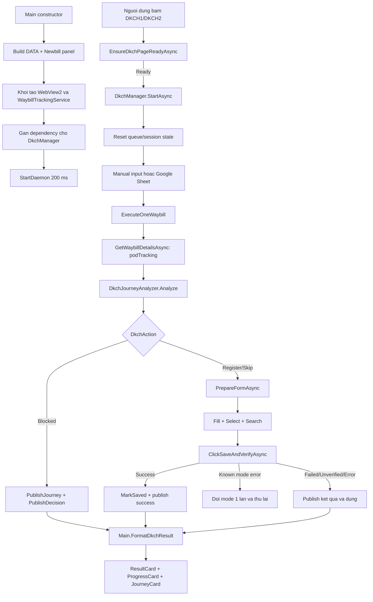

# Review feature: DKCH (Dang ky Chuyen Hoan)

## 1. Pham vi va snapshot

Tai lieu nay mo ta luong DKCH dang co tren working tree hien tai.

- Commit lam moc: `86c8a5d` (`feat: upgrade DKCH workflows and prepare v1.26.9`).
- Working tree dang co nhieu thay doi chua commit o cac module khac; review nay chi doc va phan tich luong DKCH, khong suy dien rang moi thay doi deu da duoc release.
- Cac file trung tam: `src/AutoJMS/Forms/Main.cs`, `src/AutoJMS/Automation/WebViewAutomation.cs`, `src/AutoJMS/Automation/DkchJourneyAnalyzer.cs`, `src/AutoJMS/Automation/Tab2Config.cs`, `src/AutoJMS/Tracking/WaybillTrackingService.cs`, `src/AutoJMS/modules/tab2config.json`.

## 2. Muc tieu cua feature

DKCH tu dong ho tro dang ky chuyen hoan tren trang JMS. App phai:

1. Kiem tra trang JMS va phien dang nhap truoc khi chay.
2. Nhan mot ma hoac danh sach ma tu nguoi dung, hoac doc ma tu Google Sheet.
3. Doc lich su hanh trinh cua tung ma truoc khi thao tac.
4. Ap dung luat nghiep vu de quyet dinh co duoc phep dang ky hay phai chan.
5. Tu dong dien form, chon DKCH1/DKCH2, tim ma va bam `Luu va them moi`.
6. Chi doi mode khi JMS tra ve loi mode ro rang; tranh bam Luu lap do timeout hoac loi UI.
7. Dua ket qua va lich su len panel Newbill de nguoi van hanh co the doi chieu.

Feature khong co persistence rieng cho ket qua DKCH. Lich su duoc doc tu JMS, danh sach sheet chi la nguon dau vao, con queue, so lan OK va danh sach da xu ly la state trong RAM cua `DkchManager`.

## 3. So do luong tong quat



## 4. Khoi tao UI va dependency

### 4.1 Constructor cua Main

`Main` tao hai khu vuc DKCH bang code ngay sau `InitializeComponent()`:

- `BuildDkchDataSection()` tao cac control mode huong dan, sheet, cot, toggle dung sheet va bo dem (`Main.cs:154-160`, `Main.DkchData.cs:65-140`).
- `BuildDkchNewbillSection()` tao hai danh sach ma, result card, tip bar, progress card va journey card (`Main.cs:158-160`, `Main.DkchNewbill.cs:55-110`).
- Sau khi theme duoc ap dung, ca hai khu vuc duoc layout lai (`Main.cs:182-192`).
- Enter trong o ma la lenh gui; input duoc bat o `KeyDown`, khong cho chen newline vao giua ma (`Main.cs:161-168`, `Main.cs:2571-2627`).

### 4.2 Wiring service

Sau khi WebView2 va tracking service san sang, `Main` gan:

- WebView DKCH vao `DkchManager`.
- `WaybillTrackingService` vao `DkchManager`.
- Callback doc `useSheet`, `sheetName`, `rowCount` tu UI.
- Khoi dong daemon (`Main.cs:665-672`).

Event tu manager duoc map ve UI:

- `OnSaveCountChanged` cap nhat so OK.
- `OnTrackingHistoryChanged` cap nhat hanh trinh text fallback.
- `OnWaybillCompleted` xoa ma khoi danh sach dang thuc hien.
- `OnResultChanged` vao mot diem duy nhat la `FormatDkchResult` (`Main.cs:296-325`).

## 5. Bat dau va kiem tra trang JMS

Nut DKCH1/DKCH2 chi chay khi manager khong dang xu ly. Cac handler:

- `tabDKCH_btnDKCH1_Click` goi `EnsureDkchPageReadyAsync`, sau do `StartAsync("DKCH1")` (`Main.cs:2208-2235`).
- `tabDKCH_btnDKCH2_Click` tuong tu voi `StartAsync("DKCH2")` (`Main.cs:2238-2265`).
- Nut Stop goi `DkchManager.Stop()` (`Main.cs:2267-2272`).

`EnsureDkchPageReadyAsync` probe DOM va phan loai trang thanh `Ready`, `NotLoggedIn`, `WrongPage`, `Loading` hoac `Error` (`Main.cs:2309-2353`, `2403-2513`). Trang duoc coi la ready khi dung host JMS, dung route DKCH va co du ba control: o ma, dropdown va nut tim kiem. Marker chuoi tieng Viet/Trung chi la thong tin phu; dieu nay tranh loi khi JMS doi ngon ngu.

`DkchManager.StartAsync` se dieu huong toi route DKCH neu WebView dang o trang khac, dung phien cu, dat mode, tao `CancellationTokenSource`, xoa queue/session state, reset counter va ghi log start (`WebViewAutomation.cs:1108-1139`).

## 6. Nguon dau vao va queue

### 6.1 Input thu cong

`ParseDkchWaybills` tach theo dong, trim, uppercase, chi chap nhan `[A-Za-z0-9]{1,20}`, loai ma trung va dem ma loi (`Main.cs:2544-2563`). Khi Enter:

1. Phai co manager dang chay.
2. Phai qua page readiness guard.
3. Xoa input sau khi accepted.
4. Ghi batch size de quyet dinh co hien goi y Newbie hay khong.
5. Dua tung ma vao danh sach dang thuc hien va priority queue (`Main.cs:2585-2615`).

`AddPriorityWaybill` tu choi ma khong hop le hoac ma dang cho trong queue. Ma da xu ly trong session van co the duoc nhap lai co chu dich (`WebViewAutomation.cs:1010-1033`).

### 6.2 Google Sheet

Daemon chay moi 200 ms. Neu khong co priority job, manager doc sheet toi da moi 15 giay, cache ket qua va xu ly tu `_lastProcessedIndex` (`WebViewAutomation.cs:1047-1105`). Sheet dung `_processedInSession` de tranh doc lai cung mot dong khi cache duoc refresh; input thu cong khong bi ap dung co che nay (`WebViewAutomation.cs:1181-1218`).

### 6.3 Threading va dung

`_isProcessing` chi cho phep mot luong queue chay tai mot thoi diem. `Stop()` cancel token va dat lai running flags (`WebViewAutomation.cs:1141-1147`). Cac event tu manager duoc marshal ve UI thread trong `Main` khi can.

## 7. Doc du lieu hanh trinh

`WaybillTrackingService.GetWaybillDetailsAsync` goi JMS API:

```text
POST operatingplatform/podTracking/inner/query/keywordList
payload = {
  keywordList: [waybill],
  trackingTypeEnum: "WAYBILL",
  countryId: "1"
}
```

`null` nghia la khong goi duoc API, 401, exception hoac response `succ != true`; list rong nghia la API thanh cong nhung khong co chi tiet (`WaybillTrackingService.cs:873-898`). `EvaluateJourneyAsync` dung cung mot ket qua cho ca quyet dinh va hien thi, tranh goi tracking hai lan (`WebViewAutomation.cs:1407-1459`).

Model `WaybillDetail` lay cac truong `scanTypeName`, `scanTime`, `uploadTime`, `scanNetworkCode`, `scanNetworkName`, `scanByName`, `staffName`, `remark1` (`WaybillTrackingService.cs:1048-1063`).

## 8. DkchJourneyAnalyzer

### 8.1 Chuan hoa timeline

`Analyze` la pure logic, khong phu thuoc WinForms/WebView2 (`DkchJourneyAnalyzer.cs:282-300`). Cac buoc:

1. Loc null.
2. Sap xep cu -> moi theo `scanTime`, fallback `uploadTime`.
3. Khi trung timestamp, dung index goc giam dan de bao toan chieu moi -> cu cua response JMS (`DkchJourneyAnalyzer.cs:312-328`).
4. Tao timeline day du cho UI, dong thoi loai noise khoi quyet dinh. Noise hien tai la kiem tra ton kho va lich su cuoc goi (`DkchJourneyAnalyzer.cs:717-745`).

### 8.2 Phan loai thao tac

`Classify` nhan dien ca nhan tieng Viet va tieng Trung:

- `Arrival`: `卸车到件`, `到件`, `Xuống hàng kiện đến`, `Xuống kiện`.
- `DispatchScan`: `出仓扫描`, `Quét phát hàng`.
- `ProblemScan`: `问题件扫描`, `Quét kiện vấn đề`.
- `Redeliver`: `重派`, `Giao lại hàng`.
- `ReturnRegister`: `退件登记`, `再次登记`, `Đăng ký chuyển hoàn`.
- `SignedCpn`, `SignedReturn`.
- `Noise` va `Other`.

Thu tu match quan trong: dang ky duoc nhan truoc cac nhan co chuoi `chuyển hoàn`, problem scan truoc dispatch, ky nhan chuyen hoan khong bi tinh nham la dang ky (`DkchJourneyAnalyzer.cs:717-745`).

### 8.3 Du lieu suy ra cho UI

Ngoai `Action` va `Reason`, analyzer tao:

- `RegisterCount`, `RedeliverCount`, `DeliveryAttemptCount`.
- Thao tac cuoi, thoi gian, network, ghi chu va operator.
- `ProblemScanTime`, `ProblemScanReason`.
- `DaysInStock`: so ngay theo lich, tinh tu arrival gan nhat (`DkchJourneyAnalyzer.cs:375-395`).
- `Entries`: timeline tu arrival Kim Tan/(LCI) gan nhat, moi nhat nam tren (`DkchJourneyAnalyzer.cs:397-435`).
- `Steps`: cac moc `DEN`, `PHAT`, `KIEN`, `DKCH`, `XNCH`, `PL`, `IN`, `KY` (`DkchJourneyAnalyzer.cs:652-689`). `XNCH` va `IN` hien chua co rule, nen luon Pending.

### 8.4 Thu tu luat nghiep vu

1. Khong co data hoac chi co noise -> `BlockedNoData`, khong dang ky.
2. Thao tac cuoi la `Ky nhan CPN` -> `BlockedSignedCpn`.
3. Thao tac cuoi la `Dang chuyen hoan` -> `BlockedReturning`.
4. Problem scan co ly do `Thay doi dia chi giao hang` -> `BlockedForward`.
5. Co dispatch scan sau cung ma chua co problem scan phia sau, va chua ky nhan sau dispatch -> `BlockedPendingProblemScan`.
   - Khong co redeliver truoc dispatch -> `NoRedeliverBeforeDispatch`.
   - Da problem scan roi lai dispatch trong cycle -> `SelfDispatchViolation`.
6. Da co `ReturnRegister` sau problem scan gan nhat -> `SkipAlreadyRegistered`.
7. Con lai -> `Register`.

Rule 5 khong tu doan nguong so ca phat. Neu JMS can 2/3 ca, server tu tra loi; app chi hien ratio tu response (`DkchJourneyAnalyzer.cs:439-537`, `WebViewAutomation.cs:409-475`).

`RegistrationLanded(before, after)` co logic phat hien moc dang ky moi sau save (`DkchJourneyAnalyzer.cs:540-558`), nhung hien tai khong co caller production nao trong `src`; no chi duoc goi trong unit test.

## 9. Automation WebView2 va save contract

### 9.1 Chuan bi form

`PrepareFormAsync` chon dropdown theo mode key, dien ma, bam tim kiem va dung cac nhip cho nho (`WebViewAutomation.cs:1616-1638`). Selector va nhan giao dien duoc lay tu `tab2config.json`, co fallback tieng Viet/Trung trong code (`Tab2Config.cs:193-290`).

`FillWaybillAsync` dong cac panel khong can thiet, dung native setter + `input/change` event de Vue nhan thay doi (`WebViewAutomation.cs:576-624`). `ClickSearchAsync` cho response toi da 3 giay, loc theo waybill hoac action envelope loi (`WebViewAutomation.cs:772-814`).

### 9.2 Phan tich response save

`ClickSaveAndVerifyAsync`:

- Bam nut dung mot lan.
- Cho toi da 8 giay, tang tu 1.5 giay de tranh timeout gia (`WebViewAutomation.cs:168-175`, `816-936`).
- Chi nhan response nho co dang action envelope; loai response `podTracking`/`keywordList` de khong nham request khac (`WebViewAutomation.cs:252-316`).
- `succ=true` -> `Success`.
- `succ=false`/`fail=true` va khong phai loi mode -> `Failed`, giu message goc va ratio.
- Khong doc duoc response -> `Unverified`, khong tu dong bam lai.
- Ma `999006328` -> can DKCH1; `137043004`/`999006082` -> can DKCH2.
- Loi thieu ca `999010051`/`999010052`, `出仓次数`, `问题件次数` duoc coi la business rejection, khong doi mode (`WebViewAutomation.cs:271-299`, `409-475`).

### 9.3 Vong lap cua mot ma

`ExecuteOneWaybill` doc journey dung mot lan, publish history, chan neu `IsBlocked`, sau do toi da hai pass save. Pass thu hai chi xuat hien neu server ro rang yeu cau doi mode; timeout, loi UI va loi la dung ngay (`WebViewAutomation.cs:1229-1386`). Save thanh cong goi `MarkSaved`, tang counter va nghi 200 ms cho JMS tao form moi (`WebViewAutomation.cs:1284-1295`, `1388-1398`).

## 10. Config thong diep va UI output

### 10.1 Tab2Config

`Tab2Config.Current` cache config sau lan doc dau. App chon file co `LastWriteTimeUtc` moi hon giua AppData va file bundled, sau do normalize dictionary va merge nhan fallback (`Tab2Config.cs:304-388`).

`Resolve` duyet `cases` tu tren xuong, case dau tien match toan bo dieu kien thang; neu khong co thi thu `actionMessages`, roi moi fallback (`Tab2Config.cs:410-467`). Ho tro match theo phase, outcome, mode, code JMS, message, registered/redelivered, thao tac cuoi va gio problem scan (`Tab2Config.cs:470-518`).

`PublishDecision` map `DkchAction` sang outcome config; `PublishFromCatalog` dong goi ket qua, stats, operator, days in stock, steps va entries vao `DkchResultInfo` (`WebViewAutomation.cs:1478-1569`).

### 10.2 Newbill panel

`FormatDkchResult` cap nhat result card, tip bar, progress card va journey card (`Main.cs:2747-2813`). Result card hien status, operator, note, ngay ton, chip DKCH/Phat lai va dải violation. Progress card hien `done/total`; journey card hien danh sach co scrollbar (`Main.DkchNewbill.cs:1357-1443`, `1486-1615`).

Normal khong hien goi y. Newbie chi hien goi y khi batch thu cong co dung mot ma; manager chot co nay tai luc xep queue de danh sach nhap sau khong lam thay doi ket qua cua ma dang chay (`WebViewAutomation.cs:970-993`, `Main.cs:2671-2695`).

## 11. Cac diem can chu y / findings

### P1 - Case `new-coming` khong bao gio match

`src/AutoJMS/modules/tab2config.json:139-145` khai bao outcome `blockedNewComing` va ghi `DkchAction.BlockeeNewComing`. Trong code khong co enum/action `BlockedNewComing`, khong co rule analyzer cho truong hop chi vua arrival, va `PublishDecision` khong emit `blockedNewComing` (`WebViewAutomation.cs:1507-1525`). `rg` chi tim thay chuoi nay trong JSON.

He qua: case enabled nhung khong the duoc chon. Don vua ve kho ma chua phat van roi vao `Register` theo analyzer va se tiep tuc bam Luu. Day la drift giua business spec trong config va executable behavior.

### P1 - Co ham xac minh sau timeout nhung khong duoc noi vao production flow

`DkchJourneyAnalyzer.RegistrationLanded` duoc viet de so sanh snapshot truoc/sau (`DkchJourneyAnalyzer.cs:540-558`), va comment cua `ClickSaveAndVerifyAsync` noi caller se doi chieu journey. Tuy nhien `ExecuteOneWaybill` chi publish `Unverified` sau timeout va return; no khong goi tracking lan hai, khong goi `RegistrationLanded` (`WebViewAutomation.cs:1312-1317`).

He qua: neu JMS da ghi nhan nhung response den cham, UI khong biet thanh cong hay that bai. Nguoi van hanh nhap lai co the tao them mot lan thao tac hoac chuyen nham sang DKCH2.

### P2 - History text fallback co the bi ghi de boi ResultChanged

Trong mot ma, `PublishJourney` duoc goi truoc `PublishDecision` (`WebViewAutomation.cs:1250-1259`). `OnTrackingHistoryChanged` dat text fallback vao `JourneyCard.EmptyText`, nhung `FormatDkchResult` luon gan lai `Entries` va `EmptyText = "Chua co du lieu hanh trinh."` (`Main.cs:2799-2805`). Khi API tra list rong/khong co structured entries, thong tin text fallback vua publish co the mat ngay sau do.

### P2 - Built-in fallback khong dong bo voi JSON bundled

`Tab2Config.Default()` chi co case success, blocked violation, blocked va failed (`Tab2Config.cs:393-408`). No khong co fallback rieng cho `blockedForward`, `blockedSignedCpn`, `blockedReturning` hoac `blockedNoProblemScan`. Neu JSON bi thieu, sai format hoac chua duoc copy sang AppData, cac action moi co the hien message generic/blank. Danh sach outcome trong readme JSON (`tab2config.json:38-49`) cung khong liet ke cac outcome moi nay.

### P2 - Hai cach cat timeline khong hoan toan cung mot quy tac

Analyzer sap xep theo `scanTime`, co tie-break va match Kim Tan bang ca ten lan code (`DkchJourneyAnalyzer.cs:312-328`, `397-418`). `BuildDkchHistoryText` lai dung thu tu list goc, chi match network name, va lay `scanByName` cho moi thao tac (`WaybillTrackingService.cs:907-955`). Vì vậy phan history text fallback co the cat moc arrival khac voi `Entries` structured trong mot so response khong dung thu tu hoac chi co `scanNetworkCode`.

### P3 - Coverage con thieu o cac lop co rui ro cao

Da co unit test tot cho:

- Luat dispatch/problem scan, redeliver, noise, thu tu mang va `RegistrationLanded` (`tests/AutoJMS.Tests/DkchJourneyAnalyzerTests.cs`).
- Parser response save, BOM, business rejection, ratio va ma doi mode (`tests/AutoJMS.Tests/DkchSaveResponseTests.cs`).
- Matcher/placeholder cua `Tab2Config` (`tests/AutoJMS.Tests/Tab2ConfigTests.cs`, `Tab2ConfigI18nTests.cs`).

Chua co test bao phu cho:

- `BlockedForward`, `BlockedSignedCpn`, `BlockedReturning`, `DaysInStock`, `Entries`, `BuildSteps`.
- Mapping tu action -> outcome -> case cua file JSON that.
- `DkchManager` queue, 15 giay sheet refresh, Start/Stop, UI event ordering.
- WebView2 integration cho selector, response listener va timeout.
- Truong hop timeout nhung server da ghi nhan.

## 12. Behavior dang co va behavior khong nen suy dien

### Dang co

- DKCH1/DKCH2 la mode khoi dau cua session; server co the yeu cau doi mode mot lan.
- `SkipAlreadyRegistered` khong phai block: analyzer tra action nay nhung manager van tiep tuc flow save. Config case `already-registered` dang tat vi design hien tai de JMS tu quyet dinh.
- Chi cac blocker trong `IsBlocked` moi bo qua Luu; hien tai gom `BlockedPendingProblemScan`, `BlockedNoData`, `BlockedForward`, `BlockedSignedCpn`, `BlockedReturning` (`DkchJourneyAnalyzer.cs:174-192`).
- Khong co ghi DB/remote event rieng khi dang ky; log va UI event la dau vet chinh.

### Khong nen suy dien

- `DkchResultInfo.AfterSave = true` khong dong nghia response da duoc doi chieu voi history moi; no chi cho biet da di qua ham save.
- `Steps` la thanh hien thi co ban, khong phai workflow engine day du; XNCH va IN chua co rule.
- `tab2config.json` la runtime config co the bi override boi ban AppData moi hon; can xem log `Tab2Config: loaded ... from ...` de biet file thuc te dang dung.

## 13. Checklist smoke test cho owner

1. Dang nhap JMS, mo tab DKCH, kiem tra guard nhan dien dung route va du control.
2. Chay DKCH1, nhap mot ma hop le, bam Stop; lap lai voi DKCH2.
3. Nhap danh sach nhieu ma, ma trung va ma co ky tu khong hop le; xac nhan chi ma hop le vao queue.
4. Kiem tra Normal/Newbie: Newbie + 1 ma co Gợi ý, Newbie + danh sach khong co Gợi ý.
5. Kiem tra journey: arrival only, dispatch chua problem scan, redeliver -> dispatch, problem scan -> dispatch lai, forward reason, ky nhan CPN, dang chuyen hoan.
6. Kiem tra case hop le: problem scan day du -> save success DKCH1; server yeu cau DKCH2 -> chi save lan hai sau khi doi mode.
7. Kiem tra business rejection `出仓次数` va `问题件次数`: hien ratio, khong doi mode va khong bam lai.
8. Kiem tra timeout save: khong co click thu hai; xem log va xac minh quy trinh xu ly ma unverified.
9. Bat dung Google Sheet, doi refresh 15 giay, xac nhan queue sheet khong lap dong da xu ly va priority input duoc uu tien.
10. Doi theme Light/Dark/Red khi panel co ma va khi panel rong; xac nhan khong mat history, tip, progress hoac layout.

## 14. Ket luan

Kien truc hien tai da tach kha ro ba lop: UI/guard trong `Main`, orchestration va WebView2 trong `DkchManager`, business decision thuần trong `DkchJourneyAnalyzer`. Diem manh lon nhat la doc journey truoc save, loc response save de tranh nham request, gioi han doi mode va khong retry mu khi timeout.

Rui ro can uu tien lam ro truoc release la drift `new-coming`, viec thieu post-save verification khi timeout, va fallback history bi ghi de. Ba diem nay anh huong truc tiep den quyet dinh dang ky va kha nang doi chieu cua nguoi van hanh.
