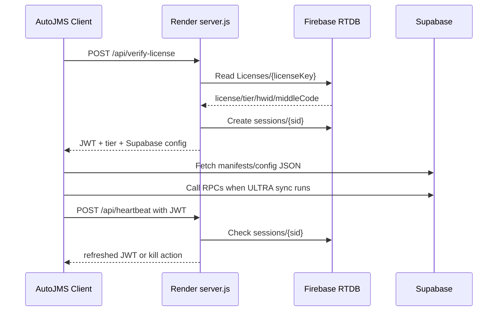

# AutoJMS Backend Operations

Date: 2026-06-11

This document is the backend runbook for AutoJMS. It covers the three backend services used by the desktop app:

- Firebase Realtime Database: license, session, tier, and office context data.
- Supabase: public control-plane manifests, runtime policies, hash manifests, selector updates, and legacy waybill/RPC database paths.
- Render: Node/Express license server that verifies licenses, issues JWTs, maintains heartbeat sessions, and returns Supabase config to the client.

Do not commit real private keys, Firebase service account files, Supabase service-role keys, license keys, or production tokens.

## Current Service Map

| Service | Current role | Production identifier |
|---|---|---|
| Firebase Realtime Database | License/session state read by Render server | `keyauthjms-default-rtdb.asia-southeast1.firebasedatabase.app` |
| Supabase project | Storage + PostgreSQL/RPC backend | `bnsnnrlwfzxemmizknwy` |
| Supabase Storage bucket | Public JSON control files | `autojms-modules` |
| Render service | License API and heartbeat API | `https://autojms-api.onrender.com` |

Backend source locations:

```text
backend/
  firebase/
    config-key.json
    license-key-schema.txt
  render-license-server/
    server.js
  supabase/
    config.toml
    seed.sql
    migrations/
```

## Data Ownership

Firebase owns:

- License key status.
- License tier.
- Bound hardware ID.
- License office code (`middleCode`).
- Per-license module/update policy.
- Data spreadsheet ID.
- Active session records.

Supabase owns:

- Public manifest/config/hash/tier/selector-update JSON.
- Legacy waybill table used by `SupabaseDbService`.
- Inventory lease table.
- RPC functions called by the desktop client.

Render owns:

- License verification endpoint.
- Session creation and heartbeat endpoint.
- JWT signing and JWT refresh.
- Mapping Firebase license fields into the client response.
- Returning Supabase project/storage/manifest config to the client.

GitHub Releases own:

- Velopack binaries: `RELEASES`, `.nupkg`, setup executables.

Supabase must not host Velopack binaries.

## Firebase

Firebase is accessed only by the Render server using Firebase Admin SDK. The AutoJMS desktop client must not connect to Firebase directly.

### License Path

```text
Licenses/{licenseKey}
```

Expected license object:

```json
{
  "createdAt": "26-05-2026 01:22",
  "status": "active",
  "tier": "ULTRA",
  "hwid": "",
  "middleCode": "214A02",
  "skipHashCheck": true,
  "modulePolicy": {
    "autoUpdate": true,
    "silentUpdate": true,
    "applyOnNextStartup": true
  },
  "dataSpreadsheetId": "",
  "updateChannel": "stable"
}
```

Required fields:

| Field | Type | Notes |
|---|---|---|
| `status` | string | `active` allows login. Any other value is rejected. |
| `tier` | string | `BASE` or `ULTRA`. Render normalizes to uppercase. |
| `hwid` | string | Empty/null means first activation binds the device. Non-empty must match client HWID. |
| `middleCode` | string | Office/site code used by print safety logic. |
| `skipHashCheck` | boolean | Allows protected builds to skip hash validation when true. |
| `modulePolicy.autoUpdate` | boolean | Legacy module auto-update flag. |
| `modulePolicy.silentUpdate` | boolean | Legacy module silent-update flag. |
| `modulePolicy.applyOnNextStartup` | boolean | Legacy module apply timing. |
| `dataSpreadsheetId` | string | Optional Google Sheet ID. |
| `updateChannel` | string | `stable` or `beta`; defaults to `stable`. |

### Session Path

```text
sessions/{sessionId}
```

Render writes:

```json
{
  "licenseKey": "<license key>",
  "hwid": "<client hwid>",
  "tier": "BASE",
  "status": "active",
  "appVersion": "1.26.6",
  "ip": "<client ip>",
  "createdAt": 1781158284000,
  "lastPing": 1781158284000
}
```

Heartbeat rejects sessions that no longer exist or whose `status` is not `active`.

### Firebase Manual Operations

Activate or reset a license:

1. Set `status` to `active`.
2. Set `tier` to `BASE` or `ULTRA`.
3. Clear `hwid` only when intentionally allowing the key to bind to a new machine.
4. Set `middleCode` to the correct office code.

Revoke a license:

1. Set `Licenses/{licenseKey}/status` to `revoked`.
2. Optionally delete matching `sessions/*` records.

Do not store update URLs or binary URLs in Firebase. Update control belongs to Supabase manifests and GitHub Releases.

## Supabase

Current project:

```text
Project ref: bnsnnrlwfzxemmizknwy
Project URL: https://bnsnnrlwfzxemmizknwy.supabase.co
Storage bucket: autojms-modules
Public storage base:
https://bnsnnrlwfzxemmizknwy.supabase.co/storage/v1/object/public/autojms-modules
```

### CLI Setup

```powershell
supabase login
supabase link --project-ref bnsnnrlwfzxemmizknwy
supabase projects list
```

Get anon key:

```powershell
supabase projects api-keys --project-ref bnsnnrlwfzxemmizknwy
```

Use the `anon` key for client/runtime configuration. Do not use `service_role` in client code or public JSON.

### Storage Layout

Uploaded public JSON files:

```text
autojms-modules/
  manifest/
    app-manifest.json
    hash-manifest.json
    tier-definitions.json
    version-latest.json
  configs/
    public-config.json
    runtime-policy.json
    runtime-policy.base.json
    runtime-policy.ultra.json
  selector-updates/
    runtime-config.json
    selector-update-manifest.json
```

Public URL examples:

```text
https://bnsnnrlwfzxemmizknwy.supabase.co/storage/v1/object/public/autojms-modules/manifest/version-latest.json
https://bnsnnrlwfzxemmizknwy.supabase.co/storage/v1/object/public/autojms-modules/configs/runtime-policy.json
https://bnsnnrlwfzxemmizknwy.supabase.co/storage/v1/object/public/autojms-modules/selector-updates/selector-update-manifest.json
```

Upload a single file:

```powershell
supabase storage cp .\infra\supabase\autojms-modules\manifest\version-latest.json `
  ss:///autojms-modules/manifest/version-latest.json `
  --linked --experimental --cache-control "max-age=60" --content-type "application/json"
```

If a file already exists, remove it first:

```powershell
supabase --yes storage rm ss:///autojms-modules/manifest/version-latest.json --linked --experimental
```

Verify storage:

```powershell
supabase storage ls ss:///autojms-modules/manifest --linked --experimental
Invoke-RestMethod "https://bnsnnrlwfzxemmizknwy.supabase.co/storage/v1/object/public/autojms-modules/manifest/version-latest.json"
```

### Database Migrations

Remote migrations currently applied:

```text
202606110001_autojms_bootstrap.sql
202606110002_tighten_autojms_privileges.sql
```

Schema created by the bootstrap migration:

| Object | Purpose |
|---|---|
| `public.waybills` | Legacy waybill/tracking table used by `SupabaseDbService`. |
| `public.inventory_sync_leases` | Lease state for inventory sync workers. |
| `public.app_manifest` | Legacy module manifest metadata. |
| `public.app_modules` | Legacy module registry. |
| `public.app_configs` | Legacy remote config rows. |
| `storage.buckets/autojms-modules` | Public storage bucket for JSON control files. |

RPC functions:

| RPC | Purpose |
|---|---|
| `try_acquire_inventory_lease(p_owner_id, p_lease_seconds)` | Acquire the inventory sync lease. |
| `refresh_inventory_lease(p_owner_id, p_lease_seconds)` | Extend a held lease. |
| `release_inventory_lease(p_owner_id)` | Release a held lease. |
| `complete_inventory_sync(p_owner_id)` | Mark inventory sync complete. |
| `upsert_new_waybills(p_waybills)` | Insert new waybills, conflict-safe. |
| `merge_waybill_tracking_rows(p_rows)` | Upsert tracking result rows. |

Permission model:

- `anon` and `authenticated` have direct `SELECT` only on public app tables required by client reads.
- Writes go through `SECURITY DEFINER` RPCs.
- Direct anon insert/update/delete to `waybills` should fail.
- `service_role` is for backend/admin use only.

Push migrations:

```powershell
supabase db push --linked
```

Verify schema:

```powershell
supabase migration list --linked
supabase db query --linked -o table "select to_regclass('public.waybills') as waybills, to_regclass('public.inventory_sync_leases') as leases;"
supabase db query --linked -o table "select proname from pg_proc where pronamespace='public'::regnamespace order by proname;"
```

Verify anon access:

```powershell
$anon = "<anon key>"
$headers = @{ apikey = $anon; Authorization = "Bearer $anon" }
$base = "https://bnsnnrlwfzxemmizknwy.supabase.co"

Invoke-WebRequest "$base/rest/v1/waybills?select=waybill_no&limit=1" -Headers $headers

$body = @{ p_waybills = @("TEST_001") } | ConvertTo-Json
Invoke-WebRequest -Method Post "$base/rest/v1/rpc/upsert_new_waybills" `
  -Headers $headers -ContentType "application/json" -Body $body
```

Remove test rows after verification:

```powershell
supabase db query --linked "delete from public.waybills where waybill_no='TEST_001';"
```

## Render License Server

Source file:

```text
backend/render-license-server/server.js
```

Render blueprint example:

```text
backend/render.yaml
```

Endpoints:

| Endpoint | Method | Purpose |
|---|---|---|
| `/health` | GET | Health check. |
| `/api/verify-license` | POST | Verify license, bind HWID if needed, create session, return JWT/config. |
| `/api/heartbeat` | POST | Validate JWT/session, update heartbeat, return refreshed JWT. |
| `/api/logout` | POST | Remove session. |

### Required Environment Variables

Set these on Render:

```text
JWT_PRIVATE_KEY=<RS256 private key PEM>
JWT_PUBLIC_KEY=<RS256 public key PEM>
SUPABASE_PROJECT_URL=https://bnsnnrlwfzxemmizknwy.supabase.co
SUPABASE_BASE_URL=https://bnsnnrlwfzxemmizknwy.supabase.co/storage/v1/object/public/autojms-modules
SUPABASE_ANON_KEY=<Supabase anon key>
DEFAULT_UPDATE_CHANNEL=stable
VALID_EXE_HASHES=<optional comma-separated hashes>
PORT=<Render sets this automatically>
```

Notes:

- `JWT_PRIVATE_KEY` and `JWT_PUBLIC_KEY` may be stored with escaped `\n`; `server.js` normalizes them.
- `SUPABASE_BASE_URL` can be omitted if the default project in `server.js` is correct.
- `SUPABASE_BASE_URL` is normalized if someone accidentally provides a dashboard bucket URL or bare project URL.
- `SUPABASE_ANON_KEY` is returned to the desktop client so `SupabaseDbService` can connect to PostgreSQL/RPC.
- Never set `SUPABASE_ANON_KEY` to the service-role key.

### Firebase Admin Credential

`server.js` loads the Firebase Admin service account from the first available source:

1. `FIREBASE_SERVICE_ACCOUNT_BASE64`
2. `FIREBASE_SERVICE_ACCOUNT_JSON`
3. `GOOGLE_APPLICATION_CREDENTIALS`
4. local fallback `./serviceAccountKey.json`

For production, provide the real service account JSON securely through Render environment variables or a Render secret file. Do not commit the real `serviceAccountKey.json` to source control.

`FIREBASE_OPERATION_TIMEOUT_MS` defaults to `8000`. Keep this configured so `/api/verify-license`, `/api/heartbeat`, and `/api/logout` fail quickly if Firebase is unreachable or misconfigured.

### Verify License Request

Client sends:

```json
{
  "licenseKey": "<license key>",
  "hwid": "<hardware id>",
  "exeHash": "<AutoJMS dll/exe hash>",
  "appVersion": "1.26.6"
}
```

Successful response includes:

```json
{
  "payload": "<license JWT>",
  "sid": "<session id>",
  "tier": "ULTRA",
  "middleCode": "214A02",
  "skipHashCheck": true,
  "modulePolicy": {
    "autoUpdate": true,
    "silentUpdate": true,
    "applyOnNextStartup": true
  },
  "license": {
    "status": "active",
    "tier": "ULTRA",
    "middleCode": "214A02",
    "skipHashCheck": true
  },
  "cfg": {
    "dataSpreadsheetId": "",
    "updateChannel": "stable"
  },
  "supabase": {
    "baseUrl": "https://bnsnnrlwfzxemmizknwy.supabase.co/storage/v1/object/public/autojms-modules",
    "projectUrl": "https://bnsnnrlwfzxemmizknwy.supabase.co",
    "anonKey": "<anon key>",
    "manifests": {
      "versionLatest": "https://.../manifest/version-latest.json",
      "hashManifest": "https://.../manifest/hash-manifest.json",
      "selectorUpdateManifest": "https://.../selector-updates/selector-update-manifest.json",
      "tierDefinitions": "https://.../manifest/tier-definitions.json"
    }
  }
}
```

### Heartbeat Request

Client sends:

```http
POST /api/heartbeat
Authorization: Bearer <license JWT>
Content-Type: application/json
```

Body:

```json
{
  "clientHwid": "<hardware id>",
  "exeHash": "<hash>"
}
```

Continue response:

```json
{
  "action": "continue",
  "payload": "<refreshed JWT>",
  "tier": "BASE"
}
```

Kill response:

```json
{
  "action": "kill",
  "reason": "Phiên làm việc đã bị Admin thu hồi."
}
```

### Local Syntax Check

```powershell
node --check backend/render-license-server/server.js
```

### Render Deployment Checklist

1. Confirm all required env vars exist.
2. Confirm real Firebase Admin credential is available to the service.
3. Deploy `backend/render-license-server/server.js`.
4. Check:

```powershell
Invoke-RestMethod "https://autojms-api.onrender.com/health"
Invoke-RestMethod "https://autojms-api.onrender.com/health/firebase"
```

5. Test `/api/verify-license` with a known non-production or controlled license key. A request with a fake but well-formed license key should return `404` JSON with `error: "LICENSE_NOT_FOUND"`, not hang and not return an HTML proxy error.
6. Confirm response includes `tier`, `middleCode`, `supabase.baseUrl`, `supabase.projectUrl`, `supabase.anonKey`, and manifest URLs.
7. Confirm logs do not print full JWTs, service-role keys, Firebase credentials, or JMS auth tokens.

## End-To-End Startup Contract



## Security Rules

- Never commit real Firebase service account credentials.
- Never commit Supabase service-role keys.
- Never return service-role keys from Render.
- Never upload `.nupkg`, setup executables, private keys, service account files, or token dumps to Supabase Storage.
- Never let BASE-tier behavior depend on ULTRA-only background sync.
- Never use Firebase for update binaries or update control-plane files.
- Do not log full production tokens. Mask to a short prefix/suffix.

## Verification Summary From 2026-06-11

Completed verification:

- Supabase project linked: `bnsnnrlwfzxemmizknwy`.
- Bucket `autojms-modules` exists and is public.
- Public manifest/config URLs return HTTP 200.
- Remote migrations exist:
  - `202606110001`
  - `202606110002`
- Tables verified:
  - `public.waybills`
  - `public.inventory_sync_leases`
  - `public.app_modules`
- RPCs verified:
  - `try_acquire_inventory_lease`
  - `refresh_inventory_lease`
  - `release_inventory_lease`
  - `complete_inventory_sync`
  - `upsert_new_waybills`
  - `merge_waybill_tracking_rows`
- Anon REST `SELECT waybills` works.
- Anon RPC `upsert_new_waybills` works.
- Direct anon insert to `waybills` is blocked.
- Test row `TEST_AUTOMATION_001` was removed.

## Common Failures

| Symptom | Likely cause | Fix |
|---|---|---|
| Client cannot fetch manifests | Wrong `SUPABASE_BASE_URL` or missing Storage upload | Verify public URL and upload JSON files. |
| `Supabase anon key is not configured` | Render did not return `supabase.anonKey` | Set `SUPABASE_ANON_KEY` on Render. |
| `401 Unauthorized` on REST | Missing/incorrect anon key or direct write blocked | Use anon key for reads/RPC; do not direct insert. |
| `db push` auth failure | Missing DB password or stale CLI auth | Re-run `supabase login`; set `SUPABASE_DB_PASSWORD` if CLI requests it. |
| Update downloads from wrong place | `version-latest.json` channel/provider/tag mismatch | Keep `provider=github`; upload only JSON to Supabase. |
| BASE starts background sync | Tier policy regression | Verify `TierRuntimePolicy` and runtime policy JSON. |
