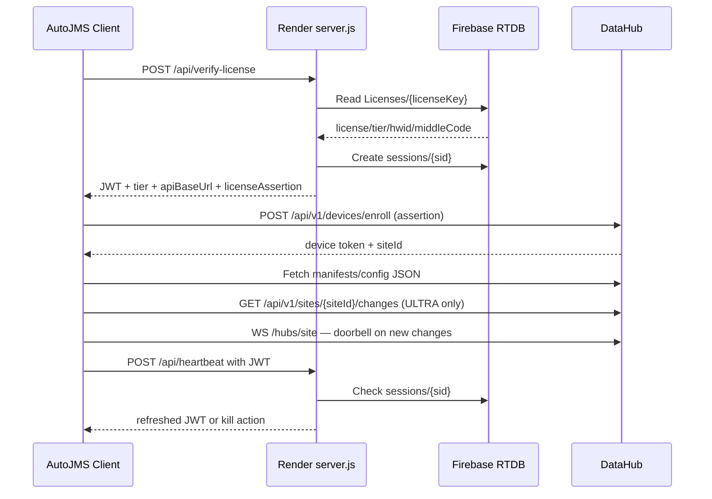

# AutoJMS Backend Operations

Date: 2026-08-23

This document is the backend runbook for AutoJMS. It covers the three backend services used by the desktop app:

- Firebase Realtime Database: license, session, tier, and office context data.
- DataHub: self-hosted ASP.NET Core API on a VPS (`AutoJMS.DataHub.Api`) fronted by Caddy, backed by PostgreSQL in Docker. Owns the waybill projection, the change feed, the site fetch lease, and device enrollment.
- Render: Node/Express license server that verifies licenses, issues JWTs, maintains heartbeat sessions, and returns DataHub config to the client.

Do not commit real private keys, Firebase service account files, the DataHub admin token, license keys, or production tokens.

## Current Service Map

| Service | Current role | Production identifier |
|---|---|---|
| Firebase Realtime Database | License/session state read by Render server | `keyauthjms-default-rtdb.asia-southeast1.firebasedatabase.app` |
| DataHub API (VPS) | Device enrollment, JMS ingest, change feed, lease, SignalR hub | `https://dev.jmsauto.online` |
| DataHub PostgreSQL | Waybill projection + operational tables, Docker on the same VPS | container `postgres`, private network only |
| Render service | License API and heartbeat API | `https://autojms-api.onrender.com` |

There is no managed BaaS behind DataHub: no hosted project ref, no storage bucket, no
PostgREST, no database-level RPC surface, and no row-level security. Every client call goes
through an explicit endpoint in `src/AutoJMS.DataHub.Api`, authenticated by a device token.

Backend source locations:

```text
backend/
  firebase/
    config-key.json
    license-key-schema.txt
  render-license-server/
    server.js
  datahub/
    Caddyfile
    Dockerfile
    docker-compose.yml
    env.production.template
    env.staging.template
    migrations/          001_core.sql .. 005_change_retention_floor.sql
    scripts/             apply-migrations, backup/restore, smoke-test, run-sql
    deploy/              VPS_DEPLOY_GUIDE.vi.md, bootstrap-vps.sh
    openapi/             datahub-v1.yaml
src/AutoJMS.DataHub.Api/  the API itself (net10.0)
```

## Data Ownership

Firebase owns:

- License key status.
- License tier.
- Bound hardware ID.
- License office code (`middleCode`).
- Per-license module/update policy.
- Data spreadsheet ID.
- Active session records.

DataHub owns:

- Public manifest/config/hash/tier/selector-update JSON, served as static files by Caddy.
- `waybill_projections` — the current-state row per waybill, read by `DataHubClient`.
- `waybill_scan_events` — the append-only ingest log the projection is folded from.
- `dashboard_changes` + `site_change_counters` — the change feed and its `change_seq` cursor.
- `site_fetch_leases` — which station is the fetch leader for a site.
- `devices` / `sites` — enrollment records, seat accounting, and device token versions.
- `idempotency_records`, `audit_logs`, `jms_event_policies`, `retention_policies`.

Render owns:

- License verification endpoint.
- Session creation and heartbeat endpoint.
- JWT signing and JWT refresh.
- Mapping Firebase license fields into the client response.
- Returning the DataHub API base URL, manifest config, and the signed enrollment assertion to the client.

GitHub Releases own:

- Velopack binaries: `RELEASES`, `.nupkg`, setup executables.

DataHub must not host Velopack binaries.

## Firebase

Firebase is accessed only by the Render server using Firebase Admin SDK. The AutoJMS desktop client must not connect to Firebase directly.

### License Path

```text
Licenses/{licenseKey}
```

Expected license object:

```json
{
  "createdAt": "26-05-2026 01:22",
  "status": "active",
  "tier": "ULTRA",
  "hwid": "",
  "middleCode": "214A02",
  "skipHashCheck": true,
  "modulePolicy": {
    "autoUpdate": true,
    "silentUpdate": true,
    "applyOnNextStartup": true
  },
  "dataSpreadsheetId": "",
  "updateChannel": "stable"
}
```

Required fields:

| Field | Type | Notes |
|---|---|---|
| `status` | string | `active` allows login. Any other value is rejected. |
| `tier` | string | `BASE` or `ULTRA`. Render normalizes to uppercase. |
| `hwid` | string | Empty/null means first activation binds the device. Non-empty must match client HWID. |
| `middleCode` | string | Office/site code used by print safety logic. |
| `skipHashCheck` | boolean | Allows protected builds to skip hash validation when true. |
| `modulePolicy.autoUpdate` | boolean | Legacy module auto-update flag. |
| `modulePolicy.silentUpdate` | boolean | Legacy module silent-update flag. |
| `modulePolicy.applyOnNextStartup` | boolean | Legacy module apply timing. |
| `dataSpreadsheetId` | string | Optional Google Sheet ID. |
| `updateChannel` | string | `stable` or `beta`; defaults to `stable`. |

### Session Path

```text
sessions/{sessionId}
```

Render writes:

```json
{
  "licenseKey": "<license key>",
  "hwid": "<client hwid>",
  "tier": "BASE",
  "status": "active",
  "appVersion": "1.26.6",
  "ip": "<client ip>",
  "createdAt": 1781158284000,
  "lastPing": 1781158284000
}
```

Heartbeat rejects sessions that no longer exist or whose `status` is not `active`.

### Firebase Manual Operations

Activate or reset a license:

1. Set `status` to `active`.
2. Set `tier` to `BASE` or `ULTRA`.
3. Clear `hwid` only when intentionally allowing the key to bind to a new machine.
4. Set `middleCode` to the correct office code.

Revoke a license:

1. Set `Licenses/{licenseKey}/status` to `revoked`.
2. Optionally delete matching `sessions/*` records.

Do not store update URLs or binary URLs in Firebase. Update control belongs to DataHub manifests and GitHub Releases.

## DataHub

Current deployment:

```text
Public host:  https://dev.jmsauto.online   (DATAHUB_PUBLIC_HOST)
Reverse proxy: Caddy, automatic HTTPS via Let's Encrypt
API:          AutoJMS.DataHub.Api, container `api`, listening on the private Docker network
Database:     PostgreSQL, container `postgres`, never published to the host
Compose file: backend/datahub/docker-compose.yml
```

### Stack Control

There is no vendor CLI. Everything is `docker compose` against the VPS, wrapped by the scripts
in `backend/datahub/scripts/` (deployed to `/opt/autojms-datahub/bin/`). `--env-file` is not
optional: `docker-compose.yml` has no `env_file:` key, so without it every `${VAR:?}` fails.

```bash
cd /opt/autojms-datahub
./bin/dc.sh --env-file .env.production ps
./bin/dc.sh --env-file .env.production logs --tail 50 api
./bin/apply-migrations.sh --env-file .env.production
```

The PowerShell counterparts (`apply-migrations.ps1`, `backup-postgres.ps1`,
`restore-postgres.ps1`, `provision-site.ps1`, `start-stack.ps1`) exist for hosts that have
PowerShell; the `.sh` scripts exist because the VPS does not.

The `postgres` service now carries a `command:` block of server settings sized to its
`mem_limit: 2g` (`shared_buffers=512MB`, `work_mem=16MB`, and the rest — the compose file
explains each). `shared_buffers` is a postmaster-start parameter, so picking them up needs a
container restart, not a reload:

```bash
./bin/dc.sh --env-file .env.production up -d postgres
```

The API reconnects on its own — its pool has `MinPoolSize = 0` and `restart: unless-stopped`
covers the rest — but the gap is a few seconds of 503s, so do it in a quiet window. Treat the
memory values as one setting: they are all derived from `mem_limit`, and raising
`shared_buffers` without raising `mem_limit` gets the container OOM-killed. The two planner
costs (`random_page_cost`, `effective_io_concurrency`) are the only entries that assume
something about the host rather than the limit — they assume SSD, and belong reverted to the
PostgreSQL defaults on spinning disk.

Device tokens are never handed out by an operator. A station calls
`POST /api/v1/devices/enroll` with a short-lived RS256 license assertion minted by the Render
server, and the API returns a device token scoped to one site. The admin token
(`DATAHUB_ADMIN_TOKEN`) is server-side only — never in client code or public JSON.

### HTTP Surface

Every route is served by the API behind Caddy. There is no REST-over-table layer and no
generated client — see `backend/datahub/openapi/datahub-v1.yaml` for the contract.

| Route | Method | Auth | Purpose |
|---|---|---|---|
| `/health/live` | GET | none | Liveness, used by Caddy and the smoke test. |
| `/health/ready` | GET | none | Readiness, includes the database probe. |
| `/api/v1/devices/enroll` | POST | license assertion | Exchange an RS256 assertion for a device token. |
| `/api/v1/sites/{siteId}/jms/ingest` | POST | device token | Append `waybill_scan_events`, fold the projection. |
| `/api/v1/sites/{siteId}/jms/observations` | POST | device token | Report JMS observations. |
| `/api/v1/sites/{siteId}/lease/acquire` | POST | device token | Become the fetch leader for the site. |
| `/api/v1/sites/{siteId}/lease/renew` | POST | device token | Extend the held lease. |
| `/api/v1/sites/{siteId}/lease/release` | POST | device token | Release the lease. |
| `/api/v1/sites/{siteId}/changes` | GET | device token | Change feed from a `change_seq` cursor. |
| `/api/v1/sites/{siteId}/projections/snapshot` | GET | device token | Full projection snapshot for a cold start. |
| `/hubs/site` | WS | device token | SignalR hub, group `site:{siteId}`, client method `change`. |

Ingest is idempotent through `idempotency_records`: replaying the same
`Idempotency-Key` returns the stored response instead of double-appending.

### Manifest Control Plane

The client reads the public JSON control files from `DATAHUB_MANIFEST_BASE_URL`, falling back
to `DATAHUB_API_BASE_URL`. Object paths, unchanged from before the migration:

```text
manifest/app-manifest.json
manifest/hash-manifest.json
manifest/tier-definitions.json
manifest/version-latest.json
configs/public-config.json
configs/runtime-policy.json
configs/runtime-policy.base.json
configs/runtime-policy.ultra.json
selector-updates/runtime-config.json
selector-updates/selector-update-manifest.json
```

`release/build-release.ps1 -Upload` publishes them with
`PUT {base}/api/v1/admin/manifests/{objectPath}` and `Authorization: Bearer $DATAHUB_ADMIN_TOKEN`.

> **Open gap.** That admin route does not exist yet: it is absent from
> `src/AutoJMS.DataHub.Api`, absent from `openapi/datahub-v1.yaml`, and the `Caddyfile` has no
> static-file handler, so `-Upload` currently returns 404. Until the endpoint lands, publish the
> manifest files by hand on the VPS (or keep serving them from the previous host) and treat
> `-Upload` as unusable. Do not "fix" this by pointing the client at a third-party bucket.

Verify what the client will actually read:

```powershell
Invoke-RestMethod "https://dev.jmsauto.online/manifest/version-latest.json"
Invoke-RestMethod "https://dev.jmsauto.online/configs/runtime-policy.json"
```

### Database Migrations

Forward-only SQL files in `backend/datahub/migrations/`, applied in filename order:

```text
001_core.sql
002_seed_policies.sql
003_seed_retention.sql
004_projection_slot_payloads.sql
005_change_retention_floor.sql
006_revocation_and_retention_indexes.sql
```

Each file records its own row in `schema_migrations` inside its own transaction, so a partially
applied run cannot claim to be complete. There is no rollback path — a mistake is corrected by
a new numbered file, never by editing an applied one.

Tables created:

| Table | Purpose |
|---|---|
| `sites` | One row per post office; owns the seat cap. |
| `devices` | Enrolled stations, device token version, last seen. |
| `waybill_scan_events` | Append-only ingest log. |
| `waybill_projections` | Current state per waybill, folded from the event log. |
| `dashboard_changes` | Change feed rows read by `/changes`. |
| `site_change_counters` | Monotonic `change_seq` allocator per site. |
| `site_fetch_leases` | Which device is the fetch leader for a site. |
| `idempotency_records` | Stored responses keyed by `Idempotency-Key`. |
| `audit_logs` | Enrollment/lease/admin audit trail. |
| `jms_event_policies` | Per-site JMS event handling policy. |
| `retention_policies` | Retention windows for the event log and change feed. |
| `revoked_device_credentials` | Revoked device credential hashes (schema only — no code reads it yet). |
| `schema_migrations` | Applied migration markers. |

`001_core.sql` also creates `create_datahub_site(...)`. It is a provisioning helper called by
`scripts/provision-site.ps1` — not a client-callable procedure. It is the only SQL function in
the schema; there is no row-level security, no `GRANT` to public roles, and no application role
other than the API's own connection user.

Apply migrations on the VPS:

```bash
cd /opt/autojms-datahub
./bin/apply-migrations.sh --env-file .env.production
```

Or from Windows against a known connection string:

```powershell
.\backend\datahub\scripts\apply-migrations.ps1 -DatabaseUrl "postgres://..."
```

Both run each file with `ON_ERROR_STOP=1` inside `--single-transaction`.

> ⚠️ **Migrations before the image, always.** `/health/ready` asserts that **every**
> migration listed above has been applied — `PostgresDataSource.RequiredMigrations`
> holds the list, and `SchemaContractTests` keeps it equal to the files on disk. So an
> API image rolled onto a database that is behind on migrations never reports ready,
> `docker-compose.yml` gates Caddy on `service_healthy`, and the site stays down until
> the migrations run. That order is deliberate — the alternative is an API serving 500s
> from a missing table — but it means `apply-migrations.sh` is a **precondition** of
> `dc.sh up -d`, not a follow-up step.
>
> This bites once, on the first deploy after 2026-08-27: readiness previously stopped
> checking at `005`, so a host that has `001`–`005` and not `006` is reporting ready
> today and will stop the moment the new image starts. Confirm before rolling:
>
> ```bash
> ./bin/run-sql.sh --env-file .env.production /dev/stdin <<'SQL'
> select version from schema_migrations order by version;
> SQL
> ```
>
> If `006_revocation_and_retention_indexes` is absent, apply migrations first. The file
> is idempotent (`IF NOT EXISTS` throughout), so running it on a host that already has
> it is a no-op.

Verify schema. `run-sql.sh` takes a **file**, not an inline string; it accepts `/dev/stdin`, so
a heredoc works without creating a temp file:

```bash
./bin/run-sql.sh --env-file .env.production /dev/stdin <<'SQL'
select version from schema_migrations order by version;
select tablename from pg_tables where schemaname = 'public' order by tablename;
SQL
```

Verify the HTTP surface end to end — staging only:

```bash
./bin/smoke-test.sh --env-file .env.staging --base https://dev.jmsauto.online
```

Ten steps: provision a site, mint a staging assertion, enroll a device, take the lease, ingest,
replay the same `Idempotency-Key`, read `/changes`, read the snapshot, five negative cases,
release the lease. It writes real rows and requires `DATAHUB_ALLOW_STAGING_TEST_ISSUER=true`,
which production must never have enabled — so never point it at production.

## Render License Server

Source file:

```text
backend/render-license-server/server.js
```

Render blueprint example:

```text
backend/render.yaml
```

Endpoints:

| Endpoint | Method | Purpose |
|---|---|---|
| `/health` | GET | Health check. |
| `/api/verify-license` | POST | Verify license, bind HWID if needed, create session, return JWT/config. |
| `/api/heartbeat` | POST | Validate JWT/session, update heartbeat, return refreshed JWT. |
| `/api/datahub/license-assertion` | POST | Re-issue a short-lived enrollment assertion for a long-running station. |
| `/api/logout` | POST | Remove session. |

### Required Environment Variables

Set these on Render:

```text
JWT_PRIVATE_KEY=<RS256 private key PEM>
JWT_PUBLIC_KEY=<RS256 public key PEM>
DATAHUB_API_BASE_URL=https://dev.jmsauto.online
DATAHUB_MANIFEST_BASE_URL=<optional; defaults to DATAHUB_API_BASE_URL>
DATAHUB_LICENSE_ASSERTION_PRIVATE_KEY=<RS256 private key PEM, signs enrollment assertions>
DATAHUB_LICENSE_ASSERTION_ISSUER=autojms-license
DATAHUB_LICENSE_ASSERTION_AUDIENCE=autojms-datahub-enroll
DATAHUB_LICENSE_ASSERTION_TTL_SECONDS=300
DATAHUB_CHANNEL=production
DATAHUB_DEFAULT_SEATS=3
DEFAULT_UPDATE_CHANNEL=stable
VALID_EXE_HASHES=<optional comma-separated hashes>
PORT=<Render sets this automatically>
```

Notes:

- `JWT_PRIVATE_KEY` and `JWT_PUBLIC_KEY` may be stored with escaped `\n`; `server.js` normalizes them.
- Render never holds a DataHub device token. It holds the assertion **signing** key and mints a
  short-lived assertion per activation; the station exchanges that for its own device token.
- `DATAHUB_LICENSE_ASSERTION_PRIVATE_KEY` unset ⇒ no assertion is issued ⇒ enrollment stays
  closed and stations run offline-only. That is the safe default, not a silent failure.
- `DATAHUB_LICENSE_ASSERTION_ISSUER` / `_AUDIENCE` / `DATAHUB_CHANNEL` must match
  `DATAHUB_LICENSE_ASSERTION_ISSUER` / `_AUDIENCE` / `DataHub__Channel` on the VPS, or enrollment
  returns 401 with no useful message.
- `DATAHUB_ADMIN_TOKEN` belongs on the VPS only. It must never reach Render, the client, or any
  public JSON.

### Firebase Admin Credential

`server.js` loads the Firebase Admin service account from the first available source:

1. `FIREBASE_SERVICE_ACCOUNT_BASE64`
2. `FIREBASE_SERVICE_ACCOUNT_JSON`
3. `GOOGLE_APPLICATION_CREDENTIALS`
4. local fallback `./serviceAccountKey.json`

For production, provide the real service account JSON securely through Render environment variables or a Render secret file. Do not commit the real `serviceAccountKey.json` to source control.

`FIREBASE_OPERATION_TIMEOUT_MS` defaults to `8000`. Keep this configured so `/api/verify-license`, `/api/heartbeat`, and `/api/logout` fail quickly if Firebase is unreachable or misconfigured.

### Verify License Request

Client sends:

```json
{
  "licenseKey": "<license key>",
  "hwid": "<hardware id>",
  "exeHash": "<AutoJMS dll/exe hash>",
  "appVersion": "1.26.6"
}
```

Successful response includes:

```json
{
  "payload": "<license JWT>",
  "sid": "<session id>",
  "tier": "ULTRA",
  "middleCode": "214A02",
  "skipHashCheck": true,
  "modulePolicy": {
    "autoUpdate": true,
    "silentUpdate": true,
    "applyOnNextStartup": true
  },
  "license": {
    "status": "active",
    "tier": "ULTRA",
    "middleCode": "214A02",
    "skipHashCheck": true
  },
  "cfg": {
    "dataSpreadsheetId": "",
    "updateChannel": "stable"
  },
  "datahub": {
    "baseUrl": "https://dev.jmsauto.online",
    "apiBaseUrl": "https://dev.jmsauto.online",
    "siteCode": "214A02",
    "licenseAssertion": "v1rs256.<base64url payload>.<base64url signature>",
    "assertionExpiresAt": 1756000000,
    "manifests": {
      "versionLatest": "https://.../manifest/version-latest.json",
      "hashManifest": "https://.../manifest/hash-manifest.json",
      "selectorUpdateManifest": "https://.../selector-updates/selector-update-manifest.json",
      "tierDefinitions": "https://.../manifest/tier-definitions.json"
    }
  }
}
```

`licenseAssertion` is not a device token and is not usable against `/api/v1/sites/...`. It is
single-purpose input to `POST /api/v1/devices/enroll`, which is what returns the device token.
Full flow: [docs/api/datahub-api-endpoints.vi.md](../docs/api/datahub-api-endpoints.vi.md).

### Heartbeat Request

Client sends:

```http
POST /api/heartbeat
Authorization: Bearer <license JWT>
Content-Type: application/json
```

Body:

```json
{
  "clientHwid": "<hardware id>",
  "exeHash": "<hash>"
}
```

Continue response:

```json
{
  "action": "continue",
  "payload": "<refreshed JWT>",
  "tier": "BASE"
}
```

Kill response:

```json
{
  "action": "kill",
  "reason": "Phiên làm việc đã bị Admin thu hồi."
}
```

### Local Syntax Check

```powershell
node --check backend/render-license-server/server.js
```

### Render Deployment Checklist

1. Confirm all required env vars exist.
2. Confirm real Firebase Admin credential is available to the service.
3. Deploy `backend/render-license-server/server.js`.
4. Check:

```powershell
Invoke-RestMethod "https://autojms-api.onrender.com/health"
Invoke-RestMethod "https://autojms-api.onrender.com/health/firebase"
```

5. Test `/api/verify-license` with a known non-production or controlled license key. A request with a fake but well-formed license key should return `404` JSON with `error: "LICENSE_NOT_FOUND"`, not hang and not return an HTML proxy error.
6. Confirm response includes `tier`, `middleCode`, `datahub.baseUrl`, `datahub.apiBaseUrl`, `datahub.licenseAssertion`, and manifest URLs.
7. Confirm logs do not print full JWTs, the assertion signing key, Firebase credentials, license assertions, or JMS auth tokens.

## End-To-End Startup Contract


```mermaid
sequenceDiagram
    participant Client as AutoJMS Client
    participant Render as Render server.js
    participant Firebase as Firebase RTDB
    participant DataHub as DataHub

    Client->>Render: POST /api/verify-license
    Render->>Firebase: Read Licenses/{licenseKey}
    Firebase-->>Render: license/tier/hwid/middleCode
    Render->>Firebase: Create sessions/{sid}
    Render-->>Client: JWT + tier + apiBaseUrl + licenseAssertion
    Client->>DataHub: POST /api/v1/devices/enroll (assertion)
    DataHub-->>Client: device token + siteId
    Client->>DataHub: Fetch manifests/config JSON
    Client->>DataHub: GET /api/v1/sites/{siteId}/changes (ULTRA only)
    Client->>DataHub: WS /hubs/site — doorbell on new changes
    Client->>Render: POST /api/heartbeat with JWT
    Render->>Firebase: Check sessions/{sid}
    Render-->>Client: refreshed JWT or kill action
```

The doorbell only says "something changed". The sync loop still pulls `/changes` by
`change_seq`, so losing the hub degrades to polling instead of losing data.

## Security Rules

- Never commit real Firebase service account credentials.
- Never commit `DATAHUB_ADMIN_TOKEN`, `DATAHUB_DEVICE_TOKEN_SIGNING_KEY`,
  `DATAHUB_ENROLLMENT_PEPPER`, or the assertion signing key. `.env.production` lives on the VPS
  only; the repo carries `env.production.template` with placeholders.
- Never return `DATAHUB_ADMIN_TOKEN` from Render, and never put it in client code or public JSON.
- Never publish `.nupkg`, setup executables, private keys, service account files, or token dumps
  through the manifest control plane. Binaries belong in GitHub Releases.
- Never enable `DATAHUB_ALLOW_STAGING_TEST_ISSUER` on production — it lets anyone mint their own
  enrollment assertion.
- Never expose the PostgreSQL port on the host. The database is reachable only over the private
  Docker network.
- Never let BASE-tier behavior depend on ULTRA-only background sync.
- Never use Firebase for update binaries or update control-plane files.
- Do not log full production tokens. Mask to `first4...last4`.

## Verification State

Verified on the VPS:

- Caddy terminates TLS for `dev.jmsauto.online` and reverse-proxies everything to `api:8080`.
- `GET /health/live` and `GET /health/ready` return 200.
- All five migrations are recorded in `schema_migrations`; the 12 tables above exist.
- `create_datahub_site(...)` is the only function in the `public` schema.
- PostgreSQL is not published to the host; only 22/80/443 are open.
- `smoke-test.sh` passes against staging, including the five negative cases.

Known gaps, still open:

- `PUT /api/v1/admin/manifests/{objectPath}` does not exist, so `build-release.ps1 -Upload`
  returns 404. The manifest control plane has no server-side write path yet.
- No `notes` / `checks` / `tasks` endpoints, so those FullStackForm panels stay local-only.
- `DeviceIdentity.Role` is carried through enrollment but never enforced anywhere.
- VPS hardening (fail2ban, unattended-upgrades, SSH password-auth off) is documented in
  `backend/datahub/deploy/VPS_DEPLOY_GUIDE.vi.md` but not yet applied.

## Common Failures

| Symptom | Likely cause | Fix |
|---|---|---|
| Client cannot fetch manifests | Wrong `DATAHUB_API_BASE_URL`/`DATAHUB_MANIFEST_BASE_URL`, or the files were never published | Fetch the public URL by hand; remember `-Upload` is currently broken. |
| `401 ASSERTION_INVALID` on enroll | Issuer/audience/channel mismatch between Render and the VPS, or a clock skew over the assertion TTL | Compare `DATAHUB_LICENSE_ASSERTION_*` and `DATAHUB_CHANNEL` on both sides. |
| Enrollment returns `409 SEAT_LIMIT_REACHED` | `deviceName` is not stable across runs, so every launch burns a seat | Keep the name derived from `MachineName` + hwid prefix; raise `seats` only deliberately. |
| `401` on `/api/v1/sites/...` | Device token expired, or the site's token version was bumped | Let `HeartbeatSupervisor` rotate it; re-enroll if the device row was revoked. |
| Every `${VAR:?}` fails on `docker compose` | `--env-file` omitted | Use `./bin/dc.sh`, which always passes it. |
| Migration "succeeded" but re-runs next deploy | The file did not record its own marker | Fix the file to insert into `schema_migrations` inside its transaction. |
| Update downloads from wrong place | `version-latest.json` channel/provider/tag mismatch | Keep `provider=github`; the DataHub side serves only JSON. |
| BASE starts background sync | Tier policy regression | Verify `TierRuntimePolicy` and runtime policy JSON. |
