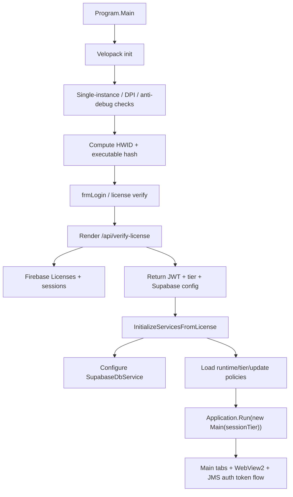
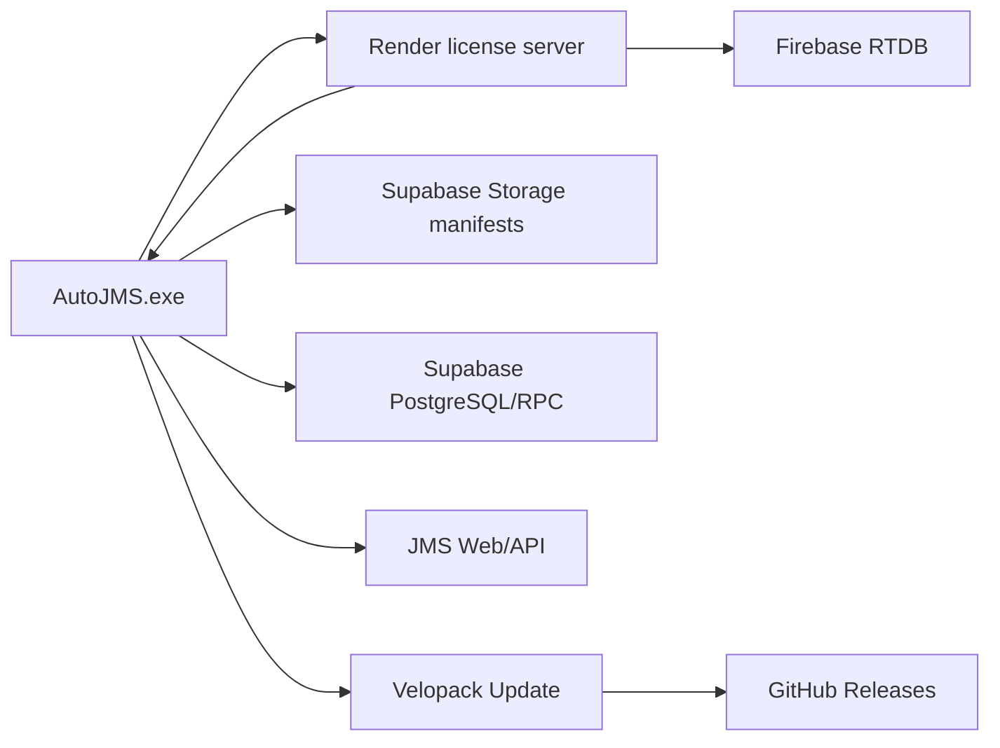
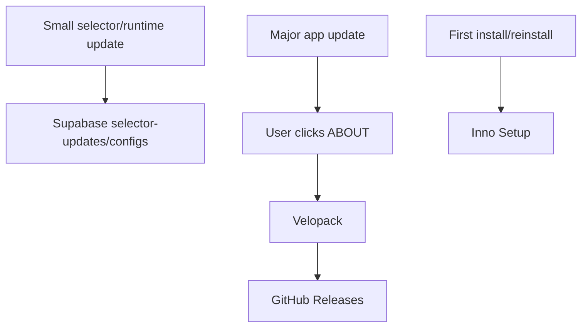

# AutoJMS Project Overview Hiện Tại

Ngày cập nhật: 2026-06-12

Tài liệu này mô tả trạng thái hiện tại của toàn bộ project `D:\v1.2605.2(new-test)`. Nếu tài liệu cũ trong repo có thông tin mâu thuẫn, ưu tiên tài liệu này, `AGENTS.md`, `.agent/context/`, `.agent/rules/`, `docs/audit/CODEBASE_AUDIT.md`, và source code hiện tại.

## 1. Tóm Tắt

AutoJMS là ứng dụng desktop logistics automation cho vận hành J&T/JMS tại Việt Nam.

Ứng dụng chính là .NET 8 WinForms, dùng SunnyUI cho giao diện và WebView2 để thao tác với hệ thống JMS/Zalo. Backend gồm Render license server, Firebase Realtime Database, Supabase Storage/PostgreSQL, GitHub Releases, Inno Setup và Velopack.

Mục tiêu sản phẩm:

- Tự động hóa đăng ký chuyển hoàn (`DKCH`).
- Theo dõi vận đơn (`TRACKING`).
- In nhãn/phiếu (`PRINT`).
- Quản lý license, tier, session.
- ULTRA tier có `FullStackOperation` riêng cho dashboard, realtime/sync, SLA/thời hiệu, Zalo/chat và workflow nâng cao.

## 2. Trạng Thái Verified Hiện Tại

Đã xác nhận trong workspace:

- Main project: `src/AutoJMS/AutoJMS.csproj`.
- Target framework: `net8.0-windows`.
- Runtime: `win-x64`.
- Build mode: self-contained.
- Current version trong csproj: `1.26.6`.
- Main UI nằm ở `src/AutoJMS/Forms/Main.cs`.
- Login form: `src/AutoJMS/Forms/frmLogin.cs`.
- ULTRA form: `src/AutoJMS/Forms/FullStackOperation.cs` và các partial files.
- BASE tabs: `HOME`, `DKCH`, `TRACKING`, `PRINT`, `ABOUT`.
- ABOUT phải là tab cuối.
- `FullStackOperation` là form riêng, không phải tab.
- Render server source: `backend/render-license-server/server.js`.
- Supabase project hiện tại: `bnsnnrlwfzxemmizknwy`.
- Supabase bucket: `autojms-modules`.
- Render production URL: `https://autojms-api.onrender.com`.
- Latest local build verified: `dotnet build .\src\AutoJMS\AutoJMS.csproj -c Debug --no-restore /clp:Summary` thành công, `0 Error(s)`.

## 3. Tech Stack

| Layer | Công nghệ | File/ghi chú |
|---|---|---|
| Desktop runtime | .NET 8 WinForms | `src/AutoJMS/AutoJMS.csproj` |
| UI library | SunnyUI `3.9.6` | package reference |
| Browser automation | WebView2 `1.0.3912.50` | JMS/Zalo browser surfaces |
| Desktop update | Velopack `1.2.0` | manual major update từ ABOUT |
| Installer | Inno Setup | first install/reinstall/uninstall |
| License API | Node.js/Express trên Render | `backend/render-license-server` |
| License DB | Firebase Realtime Database | `Licenses`, `sessions` |
| Control plane | Supabase Storage | manifests/config/hash/tier/selector-update JSON |
| Operational DB | Supabase PostgreSQL/RPC | waybills, inventory lease, tracking merge |
| Binary hosting | GitHub Releases | Velopack assets, không upload `.nupkg` lên Supabase |
| Local FullStack DB | SQLite | `src/AutoJMS/FullStack/LocalDb` |
| Protection | .NET Reactor | optional Release target via `RunReactor=true` |

## 4. Cấu Trúc Repo

```text
D:\v1.2605.2(new-test)
├── AGENTS.md
├── AutoJMS.slnx
├── README.md
├── NEXT_ACTIONS.md
├── .agent/
│   ├── context/
│   └── rules/
├── src/
│   ├── AutoJMS/
│   │   ├── AutoJMS.csproj
│   │   ├── Program.cs
│   │   ├── Forms/
│   │   ├── Automation/
│   │   ├── Config/
│   │   ├── Data/
│   │   ├── Diagnostics/
│   │   ├── FullStack/
│   │   ├── Licensing/
│   │   ├── Models/
│   │   ├── ModuleSystem/
│   │   ├── Policies/
│   │   ├── Printing/
│   │   ├── Services/
│   │   ├── Tracking/
│   │   ├── UI/
│   │   ├── Updates/
│   │   └── modules/
│   └── AutoJMS.Abstractions/
├── backend/
│   ├── render-license-server/
│   ├── supabase/
│   ├── firebase/
│   ├── render.yaml
│   ├── BACKEND_DEPLOY_STATUS.md
│   ├── BACKEND_OPERATIONS.md
│   └── BACKEND_APP_RUN_MANUAL.vi.md
├── installer/
│   └── inno/
├── release/
├── tools/
├── tests/
├── docs/
└── archive/
```

## 5. Luồng Khởi Động Ứng Dụng



Startup responsibilities:

- `Program.cs`: Velopack init, HWID, license verify, offline fallback, service initialization, module sync, integrity checks, app run.
- `LicenseApiService.cs`: gọi Render `/api/verify-license`, parse JWT/tier/Supabase config, heartbeat.
- `SupabaseDbService.cs`: nhận Supabase project URL và anon key từ Render response, khởi tạo Supabase client.
- `Main.cs`: dựng tabs, WebView2, tier policy, DKCH/tracking/print services, auth token capture.

## 6. UI Và Tier Model

### BASE

BASE là tier ổn định, chỉ có core tabs:

```text
HOME, DKCH, TRACKING, PRINT, ABOUT
```

BASE không được:

- chạy startup inventory sync;
- chạy database tracking nền;
- chạy auto-sync timer;
- tạo hoặc mở `FullStackOperation`;
- chạy realtime FullStack.

### ULTRA

ULTRA kế thừa BASE và thêm:

- `FullStackOperation` visible form;
- background inventory sync;
- database tracking;
- auto-sync timer;
- FullStack realtime/dashboard/workflow.

### Single Source Of Truth

Tier phải đi qua:

```text
src/AutoJMS/Licensing/TierRuntimePolicy.cs
src/AutoJMS/tier-definitions.json
Supabase manifest/tier-definitions.json
Supabase configs/runtime-policy*.json
```

Không hardcode kiểu:

```csharp
if (CurrentTier == "ULTRA")
```

Mẫu đúng:

```csharp
if (_tierPolicy.EnableBackgroundAutoSync)
{
    _autoSyncTimer.Start();
}
```

## 7. Backend Tổng Quan



### Render

Source:

```text
backend/render-license-server/server.js
backend/render-license-server/package.json
backend/render.yaml
```

Endpoints:

| Endpoint | Method | Vai trò |
|---|---|---|
| `/health` | GET | health check |
| `/api/verify-license` | POST | verify license, bind HWID, create session, trả JWT/config |
| `/api/heartbeat` | POST | validate JWT/session, refresh JWT |
| `/api/logout` | POST | xóa session |

Render server hiện hỗ trợ:

- `.env` cho local development.
- Firebase Admin credential qua JSON env, base64 env, file path, hoặc fallback `serviceAccountKey.json`.
- Supabase project URL và anon key trong response.
- Timeout Firebase qua `FIREBASE_OPERATION_TIMEOUT_MS`.

### Firebase

Firebase chỉ dùng server-side qua Render.

Paths chính:

```text
Licenses/{licenseKey}
sessions/{sessionId}
```

License object kỳ vọng:

```json
{
  "status": "active",
  "tier": "ULTRA",
  "hwid": "",
  "middleCode": "214A02",
  "skipHashCheck": true,
  "modulePolicy": {
    "autoUpdate": true,
    "silentUpdate": true,
    "applyOnNextStartup": true
  },
  "dataSpreadsheetId": "",
  "updateChannel": "stable"
}
```

### Supabase

Project hiện tại:

```text
bnsnnrlwfzxemmizknwy
https://bnsnnrlwfzxemmizknwy.supabase.co
```

Bucket:

```text
autojms-modules
```

Public storage base:

```text
https://bnsnnrlwfzxemmizknwy.supabase.co/storage/v1/object/public/autojms-modules
```

Remote migration hiện tại:

```text
202606110001_autojms_bootstrap.sql
202606110002_tighten_autojms_privileges.sql
```

Tables/RPC chính:

| Loại | Tên |
|---|---|
| Table | `waybills` |
| Table | `inventory_sync_leases` |
| Table | `app_modules` |
| Table | `app_manifest` |
| Table | `app_configs` |
| RPC | `try_acquire_inventory_lease` |
| RPC | `refresh_inventory_lease` |
| RPC | `release_inventory_lease` |
| RPC | `complete_inventory_sync` |
| RPC | `upsert_new_waybills` |
| RPC | `merge_waybill_tracking_rows` |

Supabase Storage chỉ chứa JSON control-plane nhỏ. Không chứa `.nupkg`, setup exe, private key, token dump.

## 8. Token Model

Project có hai loại token khác nhau, không được lẫn:

| Token | Source | Format | Vai trò |
|---|---|---|---|
| License JWT | Render server | JWT RS256 | license/session/heartbeat |
| JMS AuthToken | JMS WebView2/session | 32 hex chars | gọi JMS API |

Luồng JMS AuthToken:

```text
WebView2 navigation/request/localStorage
  -> JmsAuthTokenService / JmsAuthStateService
  -> AuthStateService
  -> JmsApiClient
```

Quy tắc:

- Không dùng license JWT cho JMS API.
- Không log full token production.
- JMS token phải validate shape, không nhận token nhìn giống JWT.
- Khi JMS API trả 401, flow đúng là refresh từ WebView2 rồi retry một lần trước khi coi là thật sự expired.

## 9. Feature Areas

### HOME

Entry surface chính, WebView2 JMS browser, URL bar, lệnh `DASH` để mở FullStack nếu tier cho phép.

### DKCH

Tự động hóa đăng ký chuyển hoàn, dùng WebView2 automation và JMS API flow.

Các vùng liên quan:

```text
src/AutoJMS/Automation/
src/AutoJMS/Services/JmsApiClient.cs
src/AutoJMS/Forms/Main.cs
```

### TRACKING

Theo dõi vận đơn thủ công và service tracking.

Các vùng liên quan:

```text
src/AutoJMS/Tracking/
src/AutoJMS/Data/DatabaseTracking.cs
src/AutoJMS/Data/SupabaseDbService.cs
```

### PRINT

In nhãn/phiếu, guard an toàn in, preflight printer.

Các vùng liên quan:

```text
src/AutoJMS/Printing/
```

### ABOUT

Thông tin app, update channel, manual update check. ABOUT phải giữ cuối cùng.

Các vùng liên quan:

```text
src/AutoJMS/Updates/
src/AutoJMS/Forms/UpdateChannelDialog.cs
```

### FullStackOperation

ULTRA-only form, không phải tab.

Các vùng liên quan:

```text
src/AutoJMS/Forms/FullStackOperation*.cs
src/AutoJMS/FullStack/
```

Chức năng chính:

- Operation center/dashboard.
- Waybill workflow.
- Inventory sync.
- Journey tracking/enrichment.
- SLA/risk engine.
- Thời hiệu KPI.
- Local SQLite store.
- Zalo/chat integration qua services liên quan.

## 10. Data Và Storage

| Data | Nơi lưu | Ghi chú |
|---|---|---|
| License/session/tier | Firebase RTDB | server-side only |
| Runtime/tier/update manifest | Supabase Storage | public JSON |
| Waybill/inventory sync | Supabase PostgreSQL/RPC | dùng anon key theo RLS/grant |
| FullStack local data | SQLite | `src/AutoJMS/FullStack/LocalDb` |
| User settings/browser data | AppData/BrowserData | không commit |
| Velopack binaries | GitHub Releases | không đưa lên Supabase |
| Installer output | `installer/inno/installer-output` | ignored |

## 11. Update Và Release



Update policy:

- Small config/selector update: Supabase, có thể auto.
- Major version update: manual, user click About tab, Velopack dùng GitHub Releases.
- First install/reinstall/uninstall: Inno Setup.
- Không mở GitHub page trong update flow.
- Không upload `.nupkg` lên Supabase.

Release scripts:

```text
release/build-release.ps1
release/build-release.bat
installer/inno/build-installer.ps1
installer/inno/AutoJMS.iss
tools/reactor/AutoJMS_Reactor.nrproj
```

## 12. Module System

Module-related areas:

```text
src/AutoJMS/ModuleSystem/
src/AutoJMS.Abstractions/
src/AutoJMS/modules/
archive/old-module-system/
```

Mục đích:

- Built-in module fallback.
- Dynamic module provider/loader.
- Supabase module manifest/cache.
- Shared module contracts.

Known risk:

- Signature enforcement/module trust vẫn cần kiểm tra kỹ trước production hardening.

## 13. Diagnostics Và Capture

Diagnostics areas:

```text
src/AutoJMS/Diagnostics/
src/AutoJMS/Diagnostics/AppCapture/
docs/troubleshooting/
```

Chức năng:

- Token redaction.
- WebView capture/debug export.
- HTTP capture handler.
- App capture session/report.
- Troubleshooting WebView2/auth/update/build issues.

Quy tắc bảo mật:

- Log production không được chứa full JWT/JMS token/key.
- Sensitive files như service account/private key phải bị ignore và không copy vào output.

## 14. Build Và Chạy

Build Debug:

```powershell
cd D:\v1.2605.2(new-test)
dotnet build .\src\AutoJMS\AutoJMS.csproj -c Debug --no-restore /clp:Summary
```

Run Debug bằng project:

```powershell
dotnet run --project .\src\AutoJMS\AutoJMS.csproj -c Debug --no-restore
```

Run bằng binary:

```powershell
& "D:\v1.2605.2(new-test)\src\AutoJMS\bin\Debug\net8.0-windows\win-x64\AutoJMS.exe"
```

Chạy với local Render server:

```powershell
$env:AUTOJMS_LICENSE_API_BASE_URL = "http://localhost:3000"
& "D:\v1.2605.2(new-test)\src\AutoJMS\bin\Debug\net8.0-windows\win-x64\AutoJMS.exe"
```

## 15. Backend Setup Và Verification

Manual chi tiết:

```text
backend/BACKEND_APP_RUN_MANUAL.vi.md
backend/BACKEND_OPERATIONS.md
backend/BACKEND_DEPLOY_STATUS.md
```

Quick checks:

```powershell
cd D:\v1.2605.2(new-test)\backend\render-license-server
npm install
npm run check

cd D:\v1.2605.2(new-test)\backend\supabase
supabase migration list --linked

Invoke-RestMethod "https://autojms-api.onrender.com/health"
```

Current backend status:

- Supabase migrations local/remote đã match.
- Supabase public JSON files đã verified HTTP `200`.
- Render source đã runnable Node project.
- Render production `/health` trả `ok: true`.
- Full Render deploy/verify-license production còn phụ thuộc secret/dashboard: `JWT_PRIVATE_KEY`, `JWT_PUBLIC_KEY`, Firebase Admin service account, `SUPABASE_ANON_KEY`, Render deployment.

## 16. Tài Liệu Quan Trọng

| File | Vai trò |
|---|---|
| `AGENTS.md` | luật bắt buộc cho coding agents |
| `.agent/README.md` | context overview cho agents |
| `.agent/context/project-overview.md` | mô tả sản phẩm/kiến trúc |
| `.agent/context/current-architecture.md` | kiến trúc hiện tại |
| `.agent/rules/` | luật không được phá |
| `docs/audit/CODEBASE_AUDIT.md` | audit chính |
| `backend/BACKEND_APP_RUN_MANUAL.vi.md` | manual setup backend để app chạy |
| `backend/BACKEND_DEPLOY_STATUS.md` | trạng thái backend deploy |
| `docs/release/` | release/update docs |
| `docs/troubleshooting/` | debug/troubleshooting |
| `docs/manual/MANUAL_OPERATIONS.md` | thao tác vận hành |

## 17. Known Risks / NEED VERIFY

Các điểm cần giữ trong backlog kỹ thuật:

- Production logs không được in full JMS AuthToken hoặc JWT.
- `service_account.json` tồn tại trong workspace, cần xem là sensitive và rotate nếu từng lộ.
- Module supply-chain trust/signature enforcement cần verify/hardening.
- Cần verify end-to-end `/api/verify-license` production sau khi deploy Render env mới.
- Cần test BASE tier chắc chắn không chạy background jobs.
- Cần test ULTRA tier mở `FullStackOperation` và sync Supabase đúng.
- Cần kiểm tra update flow: major update manual từ ABOUT, không mở GitHub web page.
- Cần kiểm tra WebView2 access luôn đi qua UI thread trong các path mới.

## 18. Quy Tắc Không Được Phá

- Không sửa logic HOME/DKCH/TRACKING/PRINT/ABOUT nếu không có yêu cầu rõ.
- Không đổi namespace/class/control name nếu không có lý do.
- Không xóa/move production code nếu không có migration plan.
- Không dùng service-role Supabase key trong desktop client.
- Không log full token/key.
- Không để BASE chạy background inventory/database sync.
- Không biến `FullStackOperation` thành tab.
- ABOUT phải nằm cuối.
- Không upload Velopack `.nupkg` lên Supabase.
- Không mở GitHub page cho update.
- Không truy cập WebView2 ngoài UI thread.

## 19. Mental Model Cho Dev Mới

Nếu sửa app desktop:

1. Đọc `AGENTS.md`, `.agent/context`, `.agent/rules`, audit.
2. Xác định thay đổi thuộc layer nào: UI, license, JMS auth, Supabase, update, FullStack, installer.
3. Kiểm tra tier impact: BASE có bị chạy background không.
4. Kiểm tra token impact: license JWT hay JMS AuthToken.
5. Build Debug.
6. Nếu liên quan backend, test Render/Supabase/Firebase theo manual.
7. Nếu liên quan update, đảm bảo Supabase chỉ chứa JSON và GitHub chứa binaries.

Nếu sửa backend:

1. Không hardcode secret.
2. Dùng Render env.
3. Không trả service-role key về client.
4. Test fake license phải lỗi JSON nhanh.
5. Test license thật phải trả JWT/session/tier/Supabase config.
6. Test app login BASE/ULTRA.

