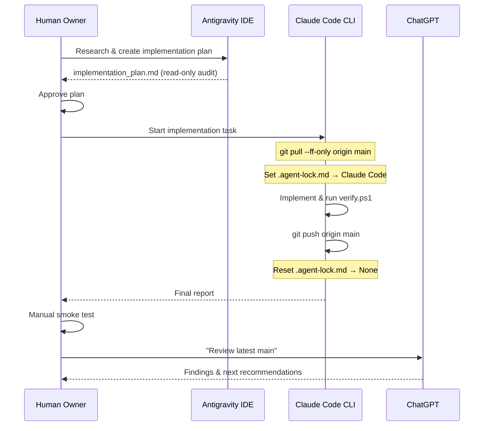

# Antigravity & Claude Code Collaboration Guide

This document outlines how Antigravity, Claude Code, and ChatGPT collaborate within the same repository to split planning, implementation, and review responsibilities.

- **Repo**: https://github.com/Datt03-sss/AutoJMS
- **Source of truth**: `origin/main`

---

## 1. Agent Profiles

| Agent | Role | Write Access |
|---|---|---|
| **Antigravity IDE** | Codebase audit, UI preview, implementation planning, walkthrough reviews | Yes — acquires lock before editing |
| **Claude Code CLI** | Active code implementation, debug loops, harness execution, commit & push | Yes — acquires lock before editing |
| **ChatGPT** | Post-push review, guidance, next-step prompting | Read-only (GitHub web) |
| **Human Owner** | Final test, merge approval, release authorization | Full — no restrictions |

---

## 2. Collaboration Flow



---

## 3. Step-by-Step Task Handoff

### Phase A: Planning (Antigravity)
1. Owner asks Antigravity to audit the codebase for the feature area (read-only).
2. Antigravity produces `implementation_plan.md` documenting what to change and why.
3. Owner reviews and approves the plan before any code is touched.

### Phase B: Implementation (Claude Code)
1. Sync from origin:
   ```powershell
   git switch main
   git pull --ff-only origin main
   ```
2. Acquire write lock in `.agent-lock.md`.
3. Implement the changes, staying within the declared Scope.
4. Build and verify:
   ```powershell
   dotnet build .\AutoJMS.slnx -c Release
   powershell -ExecutionPolicy Bypass -File .\eng\harness\verify.ps1
   ```
5. Commit and push (only if build/verify pass):
   ```powershell
   git add .
   git commit -m "<clear message>"
   git push origin main
   ```
6. Release lock. Output final report.

### Phase C: Review (ChatGPT)
1. Owner pastes the final report or points ChatGPT at the latest GitHub diff.
2. ChatGPT audits the changes from `origin/main` (read-only).
3. ChatGPT provides review notes or the next task prompt for the Owner to relay.

### Phase D: Test & Close (Owner)
1. Owner pulls and runs the app locally.
2. Owner smoke-tests the affected tabs/controls per the test checklist.
3. Owner decides whether to continue, rollback, or release.

---

## 4. Hard Limits (All Agents)

- **Never** force push or rewrite history.
- **Never** build or upload a production release without owner instruction.
- **Never** modify `Licensing/`, `JmsAuthTokenService.cs` (Firebase session), `VelopackUpdateService.cs` (Velopack prod), `release/build-release.ps1`, or WinForms Designer files unless the task explicitly targets them.
- **Never** overwrite Supabase production config or Firebase service account keys.
- **Never** edit files outside the declared `Scope` in `.agent-lock.md`.
- **Never** push if build fails.
- **Always** run `verify.ps1` before pushing.
- **Always** reset `.agent-lock.md` to `READ_ONLY` after push.
