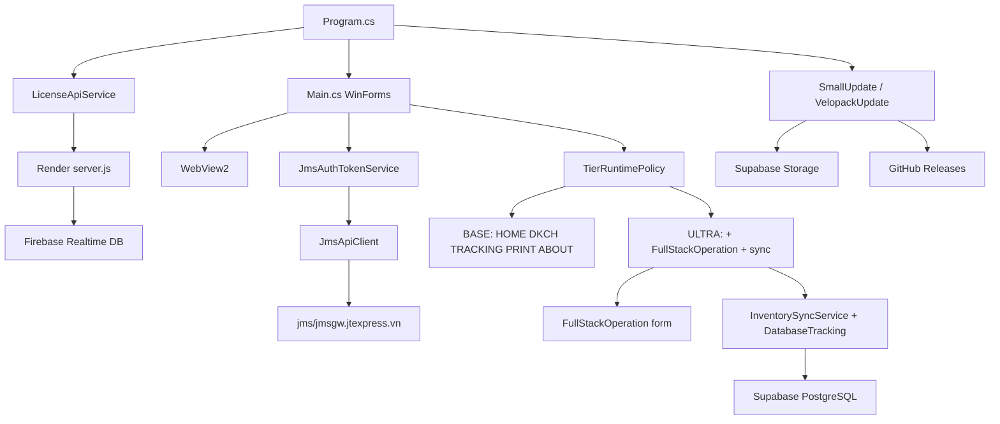

# AutoJMS — Architecture Reference

> Canonical architecture reference for AI agents. Derived from `.agent/context/current-architecture.md`.

## System Diagram



## Layers

```
┌─────────────────────────────────────────────────────┐
│                   UI Layer (WinForms)               │
│  Main.cs (TabControl)  │  FullStackOperation.cs    │
│  frmLogin.cs           │  (ULTRA only)             │
├─────────────────────────────────────────────────────┤
│                 Service Layer                       │
│  LicenseApiService    │  JmsApiClient              │
│  JmsAuthTokenService  │  InventorySyncService      │
│  VelopackUpdateService│  SmallUpdateService        │
│  SupabaseDbService    │  GoogleSheetService        │
│  DkchManager          │  PrintService              │
│  ZaloChatService      │  WaybillTrackingService    │
├─────────────────────────────────────────────────────┤
│              Module System                          │
│  ModuleStartup │ ModuleRegistry │ SupabaseProvider  │
├─────────────────────────────────────────────────────┤
│              Infrastructure                         │
│  AppPaths │ AppConfig │ AppLogger                   │
│  TierRuntimePolicy │ SecureConfigCrypto             │
├─────────────────────────────────────────────────────┤
│              External Services                      │
│  JMS WebView2 + HTTP │ Render License Server        │
│  Firebase │ Supabase │ GitHub Releases              │
└─────────────────────────────────────────────────────┘
```

## Entry Point: Program.cs

1. `VelopackApp.Build().Run()` — Velopack init
2. DPI-aware setup
3. Anti-debugger check (release only)
4. HWID computation (SMBIOS UUID + disk serial + MachineGuid)
5. License verification (online-first, offline fallback)
6. `InitializeServicesFromLicense()` — Supabase manifest, runtime config, integrity, updates
7. Module system init
8. `Application.Run(new Main(sessionTier))`

## Main Form Lifecycle

### Constructor
1. Resolve `TierRuntimePolicy` from tier name
2. Init WebView2 creation properties (shared BrowserData folder)
3. Register tabs with TabManager
4. Apply tier restrictions
5. Setup WebView2 instances
6. Start auto-sync timer (ULTRA only, gated by `_tierPolicy.EnableBackgroundAutoSync`)

### OnLoad
1. Init network monitor
2. Ensure WebView2 ready
3. Navigate to JMS home URL
4. Setup tracking/print services
5. Init DkchManager daemon
6. Refresh + validate auth token
7. Run startup sync (ULTRA only, gated by policy flags)

### OnShown
1. Pre-create FullStackOperation in background (ULTRA only)
2. Not shown until user types "DASH" in URL bar

## Two Token Types

| Token | Source | Purpose | Format |
|-------|--------|---------|--------|
| License JWT | Render server | License management | JWT (RS256) |
| JMS AuthToken | WebView2 localStorage | JMS API calls | 32-char hex |

**Never confuse these. Never log full tokens.**

## Tier Enforcement

`TierRuntimePolicy.Resolve(tier)` returns flags:
- `EnableStartupInventorySync`
- `EnableStartupDatabaseTracking`
- `EnableBackgroundAutoSync`
- `EnableFullStackOperation`
- `AllowManualTracking`
- `AllowManualPrint`

```csharp
// CORRECT — use policy flags
if (_tierPolicy.EnableBackgroundAutoSync)
    _autoSyncTimer.Start();

// WRONG — never hardcode tier string
if (CurrentTier == "ULTRA")
    _autoSyncTimer.Start();
```

## Update Architecture

| Type | Mechanism | Trigger | Source |
|------|-----------|---------|--------|
| Small config | SmallUpdateService | Auto after license | Supabase Storage |
| Major version | VelopackUpdateService | Manual (About tab) | GitHub Releases |
| First install | Inno Setup | Manual | Offline installer |

## Critical Files

| File | Purpose | ⚠ Frozen? |
|------|---------|-----------|
| Program.cs | Entry point, license, init | YES |
| Main.cs | Main form, tier enforcement | YES |
| TierRuntimePolicy.cs | Tier separation | YES |
| JmsAuthTokenService.cs | Token orchestration | YES |
| VelopackUpdateService.cs | In-app updates | YES |
| LicenseApiService.cs | License verify/heartbeat | YES |
| HashVerifier.cs | DLL integrity | YES |
| build-release.ps1 | Production release | YES |
| AutoJMS.iss | Inno Setup installer | YES |
