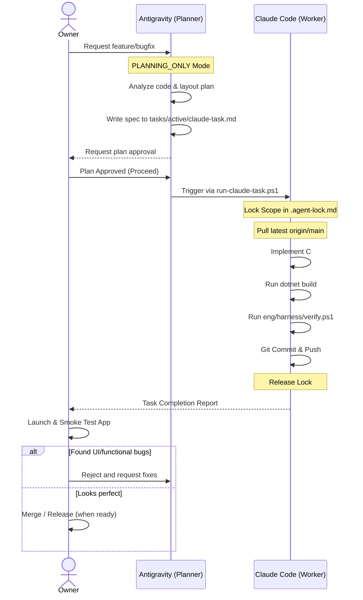

# AutoJMS Workflow: Roles and Handoff Specification

This document details the roles, responsibilities, and step-by-step handoff procedures for collaborative development between **Antigravity** and **Claude Code** on the AutoJMS repository.

---

## 1. Roles and Responsibilities

### Antigravity (UI Lead / Planner / Orchestrator)
- **Primary Domain**: UI/UX design leadership, system planning, static codebase analysis, task spec orchestration.
- **Execution Mode**: `PLANNING_ONLY` (or planning-focused). Focuses on building high-fidelity design specifications, outlining precise implementation tasks, and managing execution flows.
- **Direct Code Modification**: Restricted during planning phases to ensure clean architecture and separation of concerns. Code changes are delegated to the Worker.
- **Handoff Invoker**: Spawns and drives Claude Code tasks via automated script execution once plans are approved by the Owner.

### Claude Code (Implementation Engineer / Worker)
- **Primary Domain**: High-speed terminal-driven implementation, code writing, compilation, automated verification, commit, and git push.
- **Execution Mode**: `IMPLEMENTATION_ACTIVE`. Responsible for following the task specification down to the byte.
- **Direct Code Modification**: Authorized to modify C# codebase, layout designer files (if required), and configuration files strictly within the declared task scope.
- **Verification Gatekeeper**: Runs standard compile builds and the verify harness (`verify.ps1`), commits changes locally, and pushes to `origin/main`.

### Owner (Product Owner / Ultimate Approver)
- **Reviewer**: Inspects plans and specs created by Antigravity.
- **Gatekeeper**: Approves plan execution.
- **Manual Tester**: Runs the actual desktop app on local systems to verify visual and functional compliance.
- **Release Manager**: Solely decides when to build production installers, bump version numbers, or trigger Velopack updates.

---

## 2. Handoff Workflow Diagram

---

## 3. Strict Concurrency & Execution Rules

1. **Single-Writer Constraint**: At any single timestamp, only **one** agent is allowed to write changes. Lock state is controlled by [.agent-lock.md](../../.agent-lock.md).
2. **Read-Lock Before Edit**: Every agent session must inspect `.agent-lock.md` first. If `Current Writer` is not `None` or set to another agent, do not perform any file write operations.
3. **Task Scope Locking**: When Claude Code starts, it must verify the scope matches `Scope` declared in `.agent-lock.md`. No modifications outside the locked scope are allowed.
4. **Clean main Workflow**: No changes are allowed on dirty or out-of-date trees. All tasks must pull with `--ff-only` prior to editing.
5. **No Force Pushes**: History rewrites (`rebase -i`, `reset --hard` after push, `--force`, `--force-with-lease`) are strictly forbidden.
6. **Secrets Leak Prevention**: Never commit credentials, Firebase tokens, private key files (`.pfx`, `.pem`), or `.env` files.
