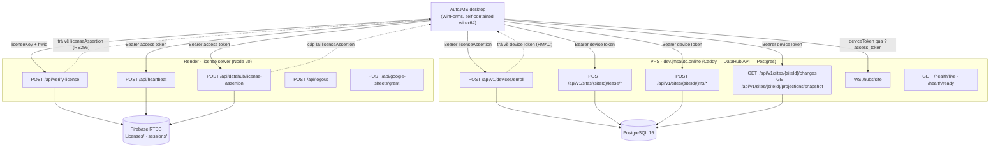
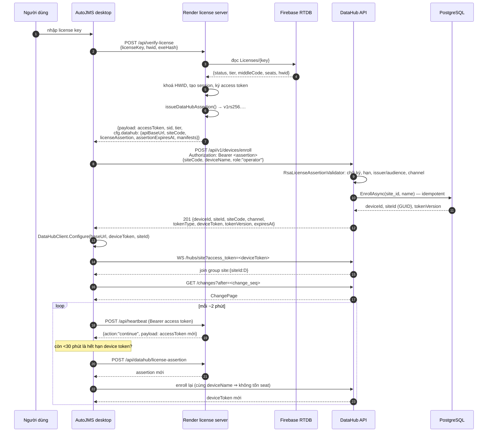
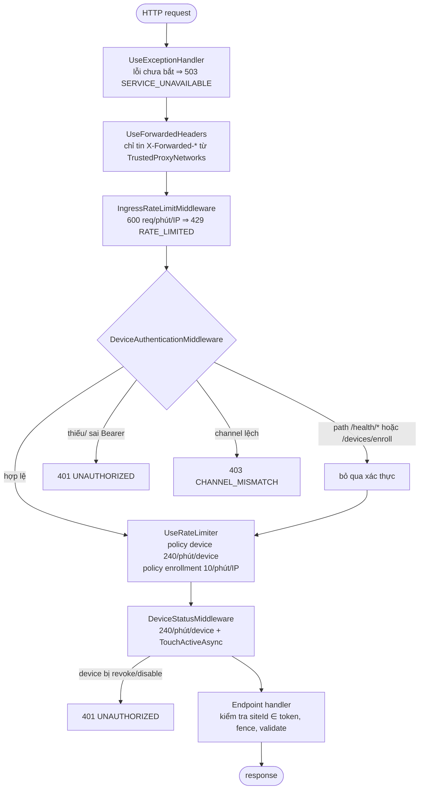
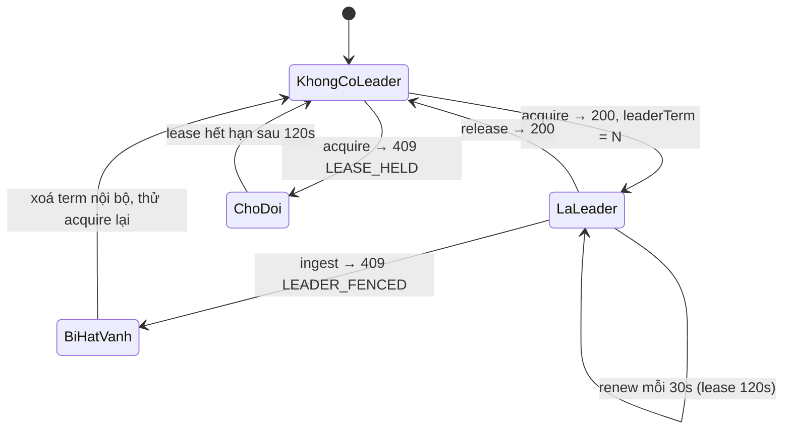
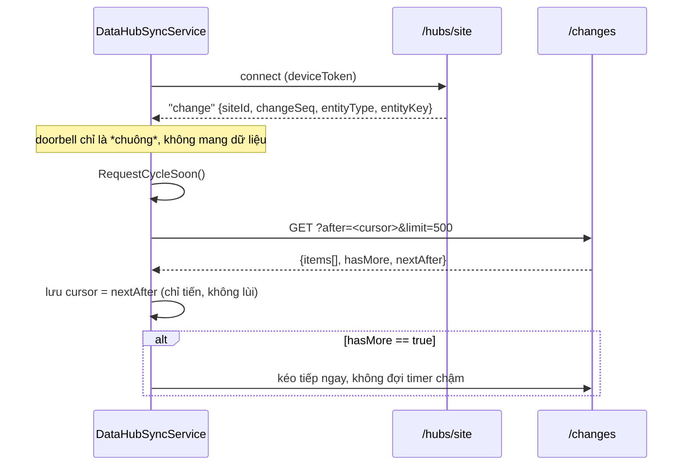
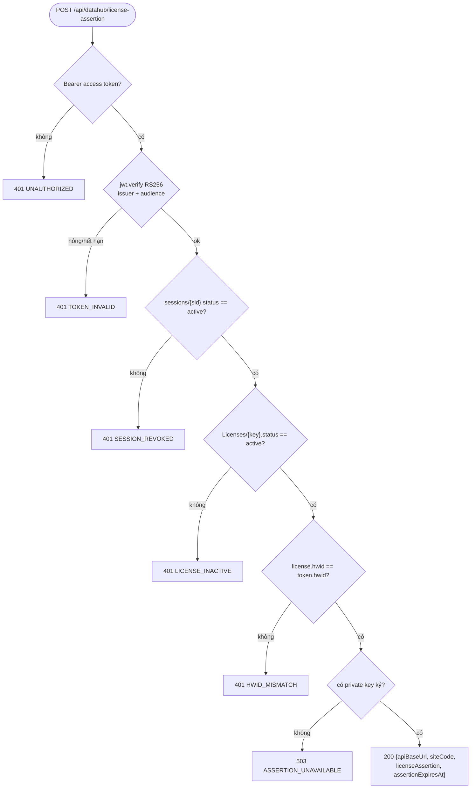
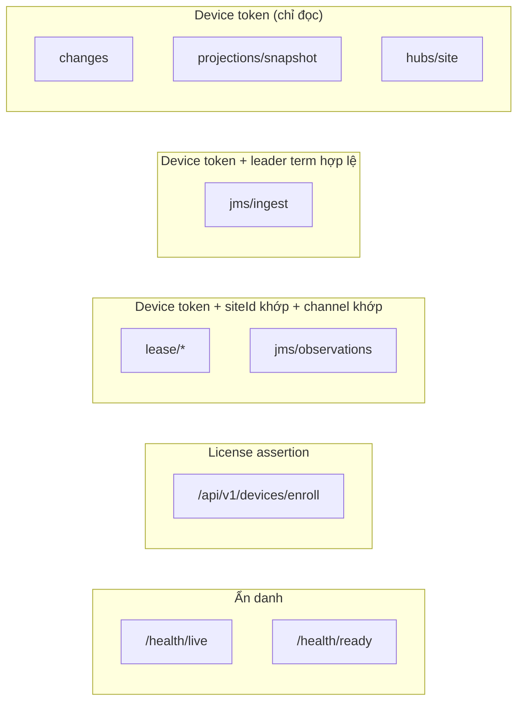

# Thiết kế API / Endpoint — Backend AutoJMS

> **Phạm vi**: toàn bộ mặt phẳng HTTP + realtime mà app desktop nói chuyện —
> Render license server (`autojms-api.onrender.com`) và DataHub API trên VPS
> (`dev.jmsauto.online`).
>
> Doc này là **hợp đồng endpoint**: đường dẫn, header, thân request/response, mã lỗi.
> Muốn biết *tại sao* thiết kế như vậy thì đọc
> [datahub-backend-design.vi.md](../architecture/datahub-backend-design.vi.md);
> muốn xem hình dạng hệ thống (topology, schema, retention) thì đọc
> [datahub-backend-diagrams.md](../architecture/datahub-backend-diagrams.md).
>
> Khi doc này mâu thuẫn với code hoặc
> [openapi/datahub-v1.yaml](../../backend/datahub/openapi/datahub-v1.yaml),
> **code là nguồn đúng.**

---

## 1. Bản đồ tổng thể

Ba dịch vụ, ba loại credential khác nhau. Không có credential nào dùng chéo được.



### Ba loại credential

| Credential | Ai cấp | Ai xác thực | Thuật toán | Sống bao lâu | Dùng ở đâu |
|---|---|---|---|---|---|
| **Access token** | Render | Render | RS256 JWT (`autojms-license-server` → `autojms-desktop-client`) | ngắn, heartbeat làm mới mỗi ~2 phút | `/api/heartbeat`, `/api/logout`, `/api/datahub/license-assertion` |
| **License assertion** | Render | DataHub API | RSASSA-PKCS1-v1_5 SHA-256, wire `v1rs256.<payload>.<sig>` | `DATAHUB_LICENSE_ASSERTION_TTL_SECONDS` (mặc định 300s) | **chỉ** `/api/v1/devices/enroll` |
| **Device token** | DataHub API | DataHub API | HMAC (`EnrollmentPepper` + `DeviceTokenSigningKey`) | `DeviceTokenLifetime`, mặc định 24h, kẹp trần bởi `license.ExpiresAt` | mọi endpoint `/api/v1/...` còn lại + `/hubs/site` |

> Render **không bao giờ** thấy device token. DataHub **không bao giờ** thấy private key
> của assertion — VPS chỉ giữ nửa public và chủ động từ chối nếu ai đó nạp nhầm private key.

---

## 2. Chuỗi license → enroll → sync

Đây là đường mà một máy trạm đi qua từ lúc nhập license key tới lúc nhận realtime.



**Hai điểm dễ sai, đã xử lý trong code:**

1. `deviceName` **phải ổn định** theo máy. `EnrollmentRepository.EnrollAsync` khoá trên
   `(site_id, name)`: cùng tên ⇒ xoay token, `token_version + 1`, **không tốn seat**; tên mới
   ⇒ tốn một seat, hết seat thì `409 SEAT_LIMIT_REACHED`. Client dựng tên bằng
   `MachineName + "-" + 8 ký tự đầu của hwid` (`LicenseApiService.BuildDeviceName`).
2. `siteId` trong response của Render thường **không phải GUID** (nó hay là middleCode).
   `DataHubClient.TryGetSiteId` dùng `Guid.TryParse`, nên phải lấy GUID từ response enroll —
   client ghi đè bằng `enrollment.SiteId`.

---

## 3. Pipeline xử lý một request DataHub

Thứ tự middleware quyết định mã lỗi nào bắn ra trước.



Ghi chú:

- Giới hạn tốc độ có **hai tầng**: theo IP ở ngoài cùng (chống spam trước khi tốn CPU xác
  thực) và theo `deviceId` ở trong (một máy hỏng không kéo cả site xuống).
- `X-Forwarded-For` chỉ được tin từ dải proxy đã khai báo. Nếu để trống danh sách,
  middleware sẽ nhận header từ bất kỳ peer nào ⇒ giả IP để né rate limit.
- Mọi lỗi đều là `application/problem+json` với trường `code` máy đọc được. 401 kèm
  `WWW-Authenticate: Bearer`; 503 và 429 kèm `Retry-After: 60`.

---

## 4. Bảng endpoint — DataHub API (VPS)

Base URL: `https://dev.jmsauto.online`

| # | Method | Path | Auth | Rate limit | Thành công | Lỗi đặc thù |
|---|---|---|---|---|---|---|
| 1 | POST | `/api/v1/devices/enroll` | license assertion | `enrollment` 10/phút/IP | `201` `EnrollmentResponse` | `401` UNAUTHORIZED · `403` CHANNEL_MISMATCH, SITE_NOT_LICENSED · `409` SEAT_LIMIT_REACHED, DEVICE_CONFLICT · `422` VALIDATION_FAILED · `503` SERVICE_UNAVAILABLE |
| 2 | POST | `/api/v1/sites/{siteId}/lease/acquire` | device token | `device` 240/phút | `200` `LeaseState` | `403` SITE_NOT_LICENSED, CHANNEL_MISMATCH · `404` NOT_FOUND · `409` LEASE_HELD |
| 3 | POST | `/api/v1/sites/{siteId}/lease/renew` | device token | `device` | `200` `LeaseState` | `400` BAD_REQUEST · `409` LEADER_FENCED |
| 4 | POST | `/api/v1/sites/{siteId}/lease/release` | device token | `device` | `200` `LeaseState` | `400` BAD_REQUEST · `409` LEADER_FENCED |
| 5 | POST | `/api/v1/sites/{siteId}/jms/ingest` | device token | `device` | `200` `IngestResponse` | `400` BAD_REQUEST · `409` LEADER_FENCED · `413` PAYLOAD_TOO_LARGE · `422` VALIDATION_FAILED |
| 6 | POST | `/api/v1/sites/{siteId}/jms/observations` | device token | `device` | `200` `IngestResponse` | như trên, **không** cần fence |
| 7 | GET | `/api/v1/sites/{siteId}/changes` | device token | `device` | `200` `ChangePage` | `400` BAD_REQUEST · `404` NOT_FOUND · `409` RESYNC_REQUIRED |
| 8 | GET | `/api/v1/sites/{siteId}/projections/snapshot` | device token | `device` | `200` `SnapshotResponse` | `403` · `404` NOT_FOUND |
| 9 | WS | `/hubs/site` | device token (header hoặc `?access_token=`) | `device` | join group `site:{siteId:D}` | abort kết nối nếu không có identity |
| 10 | GET | `/health/live` | ẩn danh | — | `200` `{status, checks}` | — |
| 11 | GET | `/health/ready` | ẩn danh | — | `200` khoẻ / `503` không | — |

`{siteId}` là route constraint `:guid` — chuỗi không phải GUID trả `404` từ router, không
vào handler.

### 4.1 `POST /api/v1/devices/enroll`

```http
POST /api/v1/devices/enroll HTTP/1.1
Authorization: Bearer v1rs256.<base64url payload>.<base64url sig>
Content-Type: application/json

{ "siteCode": "HN01", "deviceName": "WS-KHO1-A1B2C3D4", "role": "operator" }
```

```jsonc
// 201 Created
{
  "deviceId":   "3f1c…",     // GUID
  "siteId":     "9a77…",     // GUID — đây mới là giá trị DataHubClient.Configure cần
  "siteCode":   "HN01",
  "channel":    "production",
  "tokenType":  "Bearer",
  "deviceToken": "…",        // bí mật, không log
  "tokenVersion": 4,
  "expiresAt":  "2026-08-24T09:12:33+00:00"
}
```

Payload của assertion (PascalCase — validator dùng `System.Text.Json` mặc định, **phân biệt
hoa thường**; camelCase sẽ deserialize thành payload rỗng và trả 401 không kèm chẩn đoán):

```jsonc
{
  "Channel":     "production",
  "SiteCodes":   ["HN01"],
  "ExpiresAt":   1756000000,          // unix seconds
  "DataHubUrl":  "https://dev.jmsauto.online",  // https hoặc null, scheme khác bị từ chối
  "Seats":       3,
  "TokenVersion": 1,
  "Issuer":      "autojms-license",
  "Audience":    "autojms-datahub-enroll"
}
```

Quy tắc `role`: allowlist chỉ có `"operator"`. Bỏ trống ⇒ mặc định `operator`; giá trị khác
⇒ `422 VALIDATION_FAILED`. Client không được tự đặt vai trò của mình.

### 4.2 Lease — fencing cho ghi hàng loạt



- `LeaseState`: `{ siteId, leaderDeviceId, leaderTerm, leaseExpiresAt, lastSeenAt, role,
  leaseDurationSeconds: 120, renewIntervalSeconds: 30 }`.
- `renew` / `release` cần body `{ "leaderTerm": <long ≥ 1> }`. Term cũ ⇒ `409 LEADER_FENCED`
  — nghĩa là "máy khác đã lên leader", phải hạ term nội bộ về 0 rồi acquire lại.
- **"Không liên lạc được" ≠ "bị từ chối"**: client phân biệt `Granted / Denied / Unreachable`
  (`DataHubLeaseOutcome`). Gộp `Unreachable` vào `Denied` sẽ khiến cả site ngừng kéo JMS khi
  VPS chết.

### 4.3 Ingest — idempotency + fence

| Header | `jms/ingest` | `jms/observations` | Ghi chú |
|---|---|---|---|
| `Authorization: Bearer <deviceToken>` | bắt buộc | bắt buộc | |
| `Idempotency-Key` | bắt buộc, 8–128 ký tự | bắt buộc, 8–128 ký tự | ngoài khoảng ⇒ `400 BAD_REQUEST` |
| `X-Leader-Term` | **bắt buộc**, ≥ 1 | không dùng | thiếu/sai ⇒ `409 LEADER_FENCED` |
| `Content-Length` | ≤ 1 MiB | ≤ 1 MiB | vượt ⇒ `413 PAYLOAD_TOO_LARGE` (Kestrel cũng chặn cứng ở 1 MiB) |

Thân request: `{ "items": [ JmsObservation, … ] }`. Mỗi item bắt buộc có `waybillNo`
và `payload` là **object** JSON; `siteId` trong item bị ghi đè bằng `{siteId}` trên route
nên không thể ghi lén sang site khác. `UnmappedMemberHandling.Disallow` được bật toàn cục:
trường lạ trong JSON ⇒ `400`, không âm thầm bỏ qua.

Response `IngestResponse`:

```jsonc
{
  "siteId": "9a77…",
  "acceptedItems": 120,
  "duplicateItems": 5,       // trùng fingerprint, đã có sẵn
  "changedProjections": 37,
  "replayed": false,         // true ⇒ trùng Idempotency-Key, trả lại kết quả cũ
  "firstChangeSeq": 88301,
  "lastChangeSeq": 88337
}
```

Sau khi commit, API bắn doorbell SignalR. Doorbell **thất bại không làm hỏng ingest** — dữ
liệu đã nằm trong change feed, client vẫn nhặt được ở lần poll kế tiếp.

### 4.4 Đọc — change feed + snapshot + doorbell



`GET /changes` — query: `after` (long, mặc định 0, âm ⇒ `400`), `limit` (int, mặc định 500).

```jsonc
// 200 OK — ChangePage
{
  "siteId": "9a77…",
  "after": 88300,
  "items": [
    { "siteId":"9a77…", "changeSeq":88301, "entityType":"waybill",
      "entityKey":"JMS0001", "operation":"upsert",
      "changeAt":"2026-08-23T04:10:00+00:00", "body": { … } }
  ],
  "hasMore": true,
  "nextAfter": 88337
}
```

```jsonc
// 409 Conflict — cursor đã rơi ra ngoài vùng giữ lại
{ "type":"…/problems/resync-required", "title":"RESYNC REQUIRED", "status":409,
  "code":"RESYNC_REQUIRED", "detail":"The cursor is older than the retained change range; take a snapshot.",
  "traceId":"…" }
```

Gặp `RESYNC_REQUIRED` thì gọi `GET /projections/snapshot`, nạp lại toàn bộ, rồi đặt cursor
bằng `snapshot_seq`:

```jsonc
// 200 OK — SnapshotResponse
{ "siteId":"9a77…", "snapshot_seq": 88337, "items":[ ProjectionBody, … ],
  "itemCount": 1042, "generatedAt":"2026-08-23T04:10:05+00:00" }
```

> **Cursor là `change_seq`, không phải mốc thời gian.** Feed sắp theo sequence append-only;
> con trỏ đồng hồ sẽ bỏ sót hàng commit lệch thứ tự. Client dùng khoá
> `fs_sync_state["cloud_pull_waybills_seq"]` — khoá **mới** hoàn toàn, để bản cài cũ nâng cấp
> tại chỗ khởi động lại từ 0 thay vì parse chuỗi ISO thành số.

### 4.5 Realtime `/hubs/site`

| Mục | Giá trị |
|---|---|
| Đường dẫn | `/hubs/site` |
| Xác thực | `Authorization: Bearer <deviceToken>`, hoặc `?access_token=<deviceToken>` (chỉ chấp nhận trên đúng path này, vì WebSocket transport không luôn đặt được header) |
| Group | `site:{siteId:D}` — gán trong `OnConnectedAsync`, lấy từ token chứ không phải từ client |
| Server → client | method `change`, payload `ChangeDoorbell { siteId, changeSeq, entityType, entityKey }` |
| Client → server | không có method nào — hub chỉ một chiều |
| Không có identity | `Context.Abort()` |
| Package client | `Microsoft.AspNetCore.SignalR.Client` 8.0.11, ghim theo dòng 8.0.x cho bản publish self-contained win-x64 |

---

## 5. Bảng endpoint — Render license server

Base URL: `https://autojms-api.onrender.com` (đổi được bằng biến môi trường
`AUTOJMS_LICENSE_API_BASE_URL`).

| # | Method | Path | Auth | Rate limit | Mục đích |
|---|---|---|---|---|---|
| 1 | POST | `/api/verify-license` | không (gửi `licenseKey` + `hwid`) | 20/phút/IP | Kích hoạt: khoá HWID, mở session, trả access token + cfg + **license assertion** |
| 2 | POST | `/api/heartbeat` | Bearer access token | 120/phút/IP | Giữ session sống, xoay access token, nhận lệnh `kill` |
| 3 | POST | `/api/datahub/license-assertion` | Bearer access token | 60/phút/IP | **Mới** — cấp lại assertion để enroll lại khi device token sắp hết hạn |
| 4 | POST | `/api/logout` | Bearer access token | — | Đóng session |
| 5 | POST | `/api/google-sheets/grant` | Bearer access token | 60/phút/IP | Cấp token Google Sheets ngắn hạn |
| 6 | GET | `/health` · `/health/firebase` | không | — | Liveness / kiểm tra Firebase |

### 5.1 `POST /api/verify-license` — phần `cfg.datahub`

```jsonc
{
  "success": true,
  "payload": "<RS256 access token>",
  "sid": "…",
  "tier": "PRO",
  "middleCode": "HN01",
  "cfg": {
    "dataSpreadsheetId": "…",
    "updateChannel": "stable",
    "datahub": {
      "apiBaseUrl": "https://dev.jmsauto.online",
      "siteId": "HN01",              // giữ lại cho client cũ; có thể KHÔNG phải GUID
      "siteCode": "HN01",            // đây mới là thứ /devices/enroll khớp
      "licenseAssertion": "v1rs256.…",
      "assertionExpiresAt": 1756000000,
      "manifests": { … }
    }
  }
}
```

Nếu Render không có khoá ký (`DATAHUB_LICENSE_ASSERTION_PRIVATE_KEY` trống), `licenseAssertion`
là chuỗi rỗng và server ghi log cảnh báo. App vẫn kích hoạt bình thường nhưng chạy **local-only**:
không enroll được ⇒ mọi lời gọi DataHub sẽ 401. Đây là suy giảm có chủ đích, không phải lỗi.

### 5.2 `POST /api/datahub/license-assertion`



Endpoint này **không tiêu thụ `jti`**: heartbeat mới là nơi chống replay, đốt `jti` ở đây sẽ
giết đúng cái session đang xin được sống tiếp.

---

## 6. Bảng mã lỗi

Mọi lỗi DataHub trả `application/problem+json`:

```jsonc
{ "type":"https://datahub.example.com/problems/<code-kebab>", "title":"<CODE có dấu cách>",
  "status": 409, "code":"LEADER_FENCED", "detail":"…", "traceId":"…" }
```

| `code` | HTTP | Nghĩa | Client phải làm gì |
|---|---|---|---|
| `BAD_REQUEST` | 400 | Tham số sai kiểu/khoảng | Sửa request; không retry nguyên trạng |
| `UNAUTHORIZED` | 401 | Thiếu token, token hỏng/hết hạn, hoặc device đã bị revoke/disable | Enroll lại; nếu vẫn 401 thì kích hoạt lại license |
| `FORBIDDEN` | 403 | Token hợp lệ nhưng không đủ quyền | Không retry |
| `CHANNEL_MISMATCH` | 403 | Token thuộc channel khác (`staging` vs `production`) | Lỗi cấu hình triển khai — báo owner |
| `SITE_NOT_LICENSED` | 403 | `siteId` trên route không nằm trong scope token | Không retry |
| `NOT_FOUND` | 404 | Site chưa được provision | Báo owner chạy migration/seed site |
| `LEASE_HELD` | 409 | Máy khác đang giữ leader | Chờ, poll lại sau ≤ 120s |
| `LEADER_FENCED` | 409 | `X-Leader-Term` cũ hoặc thiếu | Hạ term về 0, acquire lại rồi ghi lại |
| `DEVICE_CONFLICT` | 409 | Tên thiết bị đang bị revoke/disable, hoặc trùng tên | Đổi `deviceName`, hoặc owner bật lại device |
| `SEAT_LIMIT_REACHED` | 409 | Hết seat theo license | Owner nâng `seats` hoặc thu hồi máy cũ |
| `RESYNC_REQUIRED` | 409 | Cursor cũ hơn vùng change feed còn giữ | Gọi `/projections/snapshot`, đặt cursor = `snapshot_seq` |
| `PAYLOAD_TOO_LARGE` | 413 | Body > 1 MiB | Chia nhỏ batch |
| `VALIDATION_FAILED` | 422 | Thân request thiếu trường bắt buộc | Sửa payload |
| `RATE_LIMITED` | 429 | Quá ngưỡng IP hoặc device | Đợi `Retry-After` (60s) |
| `SERVICE_UNAVAILABLE` | 503 | Phụ thuộc (Postgres / khoá ký) không sẵn sàng | Backoff, coi như offline; **không** rơi vào vòng lặp retry gấp |

Header đi kèm: `401` → `WWW-Authenticate: Bearer`; `429` và `503` → `Retry-After: 60`.

---

## 7. Ma trận quyền theo endpoint



Ba lớp kiểm tra chồng nhau, không lớp nào thay được lớp nào:

1. **Xác thực** — token ký đúng và chưa hết hạn (`DeviceAuthenticationMiddleware`).
2. **Trạng thái** — device chưa bị revoke/disable, `token_version` còn khớp
   (`DeviceStatusMiddleware.TouchActiveAsync`). Đây là thứ khiến thu hồi có hiệu lực **ngay**
   chứ không phải đợi token hết hạn.
3. **Phạm vi** — `siteId` trên route phải trùng `siteId` trong token và `channel` phải trùng
   channel của deployment (`TenantAuthorizationEvaluator`).

> `DeviceIdentity.Role` hiện **chưa** được dùng để phân quyền — mọi device enroll đều là
> `operator`. Đây là khoảng trống đã biết (P1-2), không phải thiếu sót của tài liệu này.

---

## 8. Chưa có — cố ý

Các endpoint sau **không tồn tại** ở phase 1; client có stub trả rỗng chứ không gọi:

| Chức năng client | Trạng thái |
|---|---|
| `PullOrderNotesAsync` | chưa có endpoint `/notes` |
| `PullOrderChecksAsync` | chưa có endpoint `/checks` |
| `PullDispatchTasksAsync` | chưa có endpoint `/tasks` |

Khi thêm, chúng phải đi theo đúng khuôn của `/changes`: cursor `change_seq`, phân trang
`hasMore`/`nextAfter`, và `409 RESYNC_REQUIRED` khi cursor quá cũ — chứ không phải mỗi cái
một kiểu.

---

## Đọc tiếp

- [datahub-backend-design.vi.md](../architecture/datahub-backend-design.vi.md) — lý do thiết kế
- [datahub-backend-diagrams.md](../architecture/datahub-backend-diagrams.md) — topology, schema, retention
- [render-server-api.md](./render-server-api.md) — chi tiết license server
- [backend/datahub/openapi/datahub-v1.yaml](../../backend/datahub/openapi/datahub-v1.yaml) — spec máy đọc
- [backend/datahub/deploy/VPS_DEPLOY_GUIDE.vi.md](../../backend/datahub/deploy/VPS_DEPLOY_GUIDE.vi.md) — triển khai VPS
