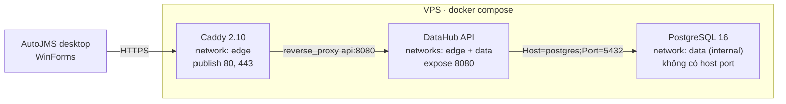
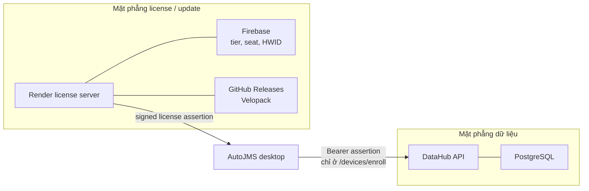
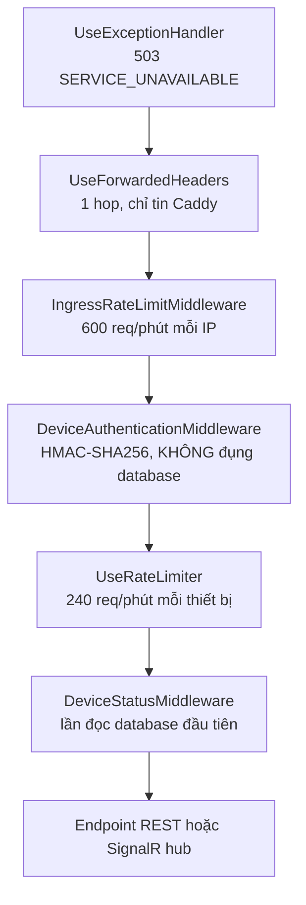
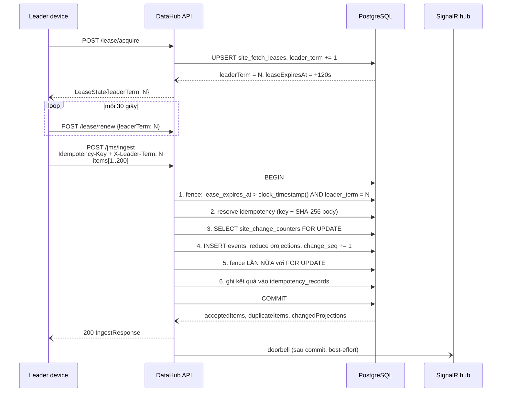
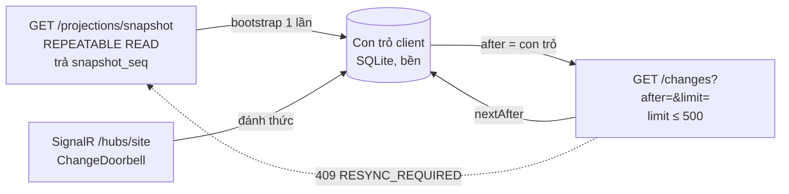
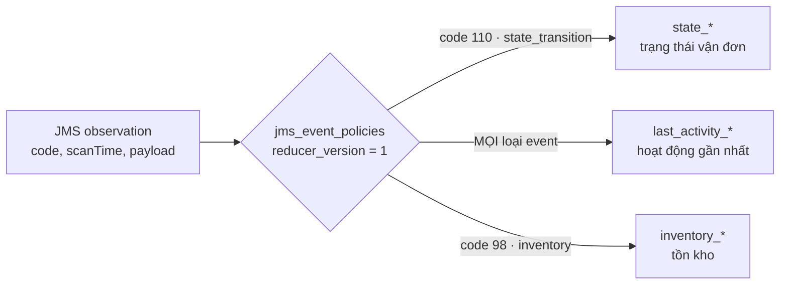
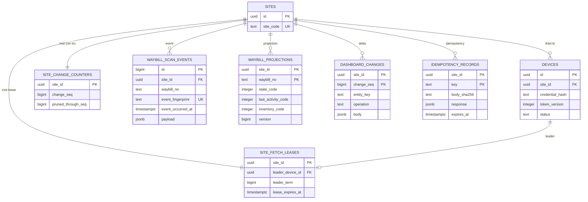
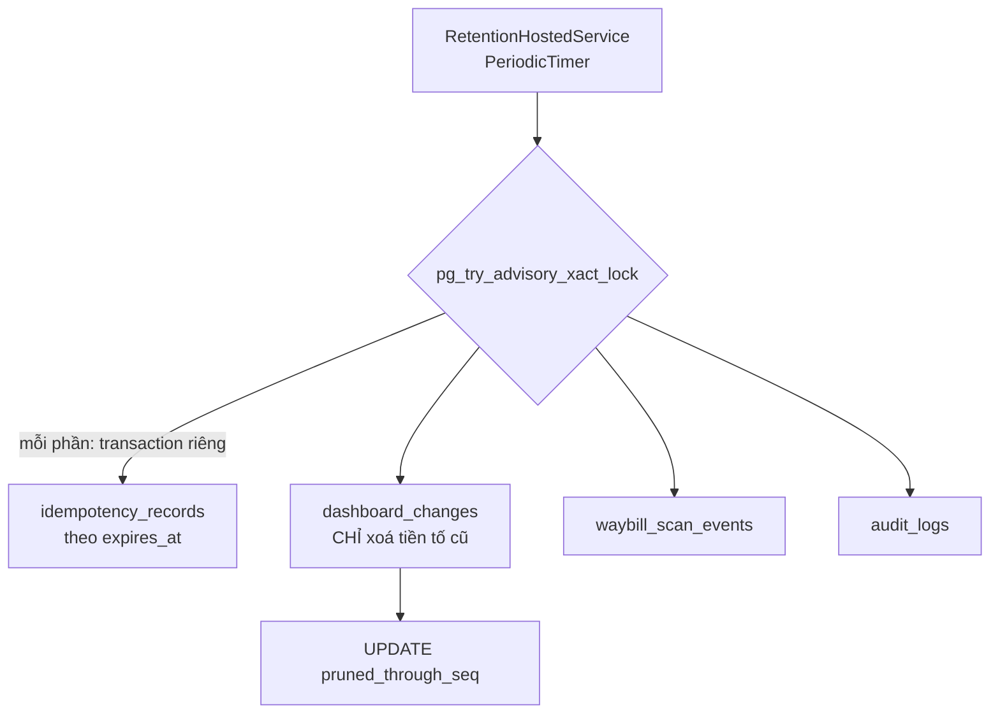

# Sơ đồ Backend AutoJMS DataHub

> Bản vẽ đi kèm [datahub-backend-design.vi.md](./datahub-backend-design.vi.md).
> Doc thiết kế giải thích **tại sao**; file này chỉ giữ **hình dạng** để tra nhanh.
>
> Khi sơ đồ ở đây và
> [openapi/datahub-v1.yaml](../../backend/datahub/openapi/datahub-v1.yaml) + code mâu thuẫn,
> **OpenAPI + code là nguồn đúng.**

Mọi sơ đồ dưới đây là Mermaid, render được trực tiếp trên GitHub.

---

## 1. Topology triển khai



Bất biến của topology — `backend/datahub/tests/deployment-static-smoke.ps1` assert cứng:

| Bất biến | Vì sao |
|---|---|
| chỉ `caddy` có `ports:` | mọi thứ khác không thể tiếp cận từ Internet |
| `api` chỉ `expose: 8080` | không bao giờ bypass được TLS |
| network `data` có `internal: true` | Postgres không có đường ra Internet |
| Postgres không map `5432` ra host | không có backdoor "psql từ ngoài" |
| `DATAHUB_API_IMAGE` phải là `@sha256:` | tag mutable ⇒ deploy không tái lập được |
| `.dockerignore` loại `.env*`, `*.pfx`, `serviceAccount*.json` | secret không lọt vào image layer |

Staging và production là **hai deployment tách hoàn toàn**: khác database, khác signing key,
khác enrollment pepper, khác nơi backup.

---

## 2. Hai mặt phẳng thẩm quyền



Hai mặt phẳng chia sẻ **đúng một** giao diện: license assertion đã ký, chứa `channel`,
`site_codes`, `seats`, `token_version`, `exp` và tuỳ chọn `datahub_url`.

- DataHub **không** đọc Firebase, **không** biết `tier`, **không** gọi Render.
- Assertion đi trong `Authorization: Bearer <assertion>`, **không** phải header riêng.
- Sau khi enroll, assertion không được dùng lại — mọi request sau đó dùng device token.
- `siteCode` trong body enroll là **bộ chọn** trong danh sách assertion cho phép, không phải
  một quyền mới. Enroll **không bao giờ** tạo site mới.

---

## 3. Pipeline HTTP



Thứ tự này là **hợp đồng**, không phải chi tiết cài đặt:

- Rate limit theo IP đứng **trước** xác thực ⇒ chặn flood bằng phép so sánh rẻ.
- Xác thực là HMAC thuần, không truy vấn database ⇒ token rác bị loại mà không tốn connection.
- Lần đọc Postgres đầu tiên nằm ở `DeviceStatusMiddleware` ⇒ tấn công không có token hợp lệ
  không bao giờ chạm database.

Đảo bất kỳ hai tầng nào là đổi tư thế bảo mật.

---

## 4. Enroll → device token

```mermaid
sequenceDiagram
    participant D as AutoJMS desktop
    participant A as DataHub API
    participant V as License assertion validator
    participant P as PostgreSQL

    D->>A: POST /api/v1/devices/enroll<br/>Authorization: Bearer &lt;assertion&gt;<br/>{siteCode, deviceName, role}
    A->>V: verify(assertion)
    alt production, chưa nối JWKS
        V--)A: unavailable
        A--)D: 503 SERVICE_UNAVAILABLE
    else assertion hợp lệ
        V--)A: claims{channel, site_codes, seats, exp}
        A->>P: resolve site theo siteCode, kiểm seat
        P--)A: site_id
        A->>A: ký device token HMAC-SHA256
        A--)D: 200 {deviceId, siteId, deviceToken, tokenVersion, expiresAt}
    end
```

Device token: `v1.<base64url(payload)>.<base64url(sig)>`.

| Hạng mục | Giá trị |
|---|---|
| Claim | `DeviceId, SiteId, Channel, Role, TokenVersion, ExpiresAt, Issuer, Audience` |
| Thuật toán | HMAC-SHA256, key ≥ 32 byte, so sánh bằng `FixedTimeEquals` |
| Gửi đi | `Authorization: Bearer <device-token>` |
| Refresh | không có — hết hạn thì enroll lại |
| Thu hồi | tăng `token_version` trong bảng `devices` |

Production hiện dùng `UnavailableLicenseAssertionValidator` — **fail-closed có chủ ý**, nên
`/devices/enroll` trả `503` cho tới khi adapter JWS/JWKS bất đối xứng được nối vào. Staging dùng
`DATAHUB_STAGING_TEST_SIGNING_KEY` + `DATAHUB_ALLOW_STAGING_TEST_ISSUER=true`; cờ đó **không**
được bật ở production.

---

## 5. Đường ghi: lease → ingest → change



Hai chi tiết dễ làm sai, đã xử lý đúng trong
[IngestRepository](../../src/AutoJMS.DataHub.Api/Infrastructure/IngestRepository.cs):

1. Fence dùng `clock_timestamp()` chứ **không** `now()`. `now()` là thời điểm *bắt đầu*
   transaction, nên một transaction dài có thể vượt qua lease đã hết hạn mà vẫn thấy fence hợp lệ.
2. Fence đặt **trước** reserve idempotency (leader đã bị fence không được "chiếm" key), và kiểm
   **lần hai** với `FOR UPDATE` để đóng khe giữa lần kiểm đầu và lúc commit.

Hai đường ingest dùng chung đúng một pipeline:

| Endpoint | Fence | Dùng khi |
|---|---|---|
| `POST /jms/ingest` | **bắt buộc** `X-Leader-Term` | đồng bộ bulk, chỉ leader |
| `POST /jms/observations` | không fence | thao tác tương tác của người dùng |

---

## 6. Đường đọc: snapshot + delta + doorbell



- `hasMore` suy ra bằng cách lấy `limit + 1` hàng, không dùng `COUNT(*)`.
- `409 RESYNC_REQUIRED` khi `after < pruned_through_seq` hoặc `after > change_seq`.
- `pruned_through_seq` tồn tại vì `MIN(change_seq)` không phân biệt được "lịch sử nguyên vẹn
  bắt đầu từ 1" với "lịch sử đã bị retention cắt" — thiếu cột này, client có thể *âm thầm*
  bỏ sót delta.
- **Mất doorbell không mất dữ liệu.** Doorbell publish sau commit trong `try/catch`, thất bại chỉ
  ghi log; payload chỉ có `siteId, changeSeq, entityType, entityKey`. SignalR là *tối ưu độ trễ*,
  không phải thành phần bắt buộc để đúng ⇒ client nên poll dự phòng theo chu kỳ chậm.

---

## 7. Ba slot projection



- Ba slot **độc lập**, mỗi slot có winner riêng theo khoá `(event_occurred_at, event_fingerprint)`.
- Fingerprint v1 (`EventFingerprintV1.Compute`) **loại trừ** `uploadTime` — `uploadTime` chỉ sống
  trong `payload` thô và không có ngữ nghĩa nghiệp vụ.
- Mã JMS không có trong `jms_event_policies` mặc định là `activity`: dữ liệu lạ vẫn được lưu và
  vẫn cập nhật `last_activity_*`, chỉ không làm nhiễu `state_*`/`inventory_*`.

---

## 8. Schema phase 1



Bảng không vẽ ở trên: `schema_migrations`, `jms_event_policies` (§7),
`retention_policies` (§9), `audit_logs`.

Mọi bảng nghiệp vụ đều có `site_id` là cột đầu tiên của khoá — tenant isolation là *hình dạng
của khoá*, không phải một `WHERE` nhớ thì thêm.

---

## 9. Retention



- Mỗi nhóm chạy trong **transaction riêng, ngắn** ⇒ retention không giữ lock lâu.
- `pg_try_advisory_xact_lock` ⇒ hai instance API không xoá chồng nhau.
- `dashboard_changes` chỉ được xoá **tiền tố toàn-cũ**, rồi mới `pruned_through_seq` tiến lên.
  Xoá lỗ giữa dải sẽ làm con trỏ client sai âm thầm.
- Retention là best-effort: lỗi chỉ `LogWarning`, một sự cố database tạm thời **không** được
  làm chết API.
- `retention_policies` là **dữ liệu**; tên bảng/cột được **allow-list trong code**. Không bao giờ
  nội suy tên bảng từ một hàng database vào SQL.

---

## Đọc tiếp

| Chủ đề | File |
|---|---|
| Thiết kế đầy đủ, có lý do | [datahub-backend-design.vi.md](./datahub-backend-design.vi.md) |
| Sơ đồ + bảng endpoint (request/response/mã lỗi) | [datahub-api-endpoints.vi.md](../api/datahub-api-endpoints.vi.md) |
| Hợp đồng API | [openapi/datahub-v1.yaml](../../backend/datahub/openapi/datahub-v1.yaml) |
| Triển khai VPS từng bước | [VPS_DEPLOY_GUIDE.vi.md](../../backend/datahub/deploy/VPS_DEPLOY_GUIDE.vi.md) |
| Schema thật | [migrations/001_core.sql](../../backend/datahub/migrations/001_core.sql) |
| Mặt phẳng license | [backend-architecture.md](./backend-architecture.md) |
