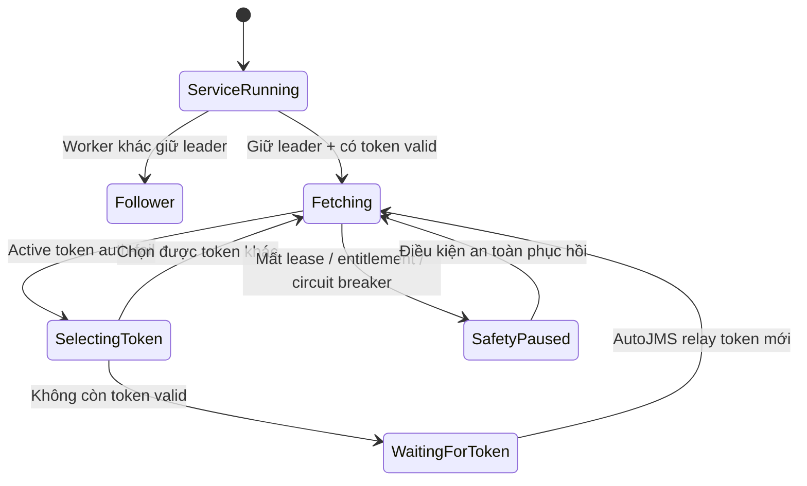

# AutoJMS DataHub — Worker Lifecycle (Windows Service) — owner-approved

> **Owner duyệt:** Windows Service + persistent token store + site leader + automatic failover.
> **Nguyên tắc cốt lõi:** **Service LUÔN chạy; fetch pipeline chỉ chạy khi đủ điều kiện.** Hết token JMS
> ⇒ **PAUSE fetch, KHÔNG terminate service** (vì lúc AutoJMS đóng sẽ không còn tiến trình nào khởi động
> lại Worker khi token mới xuất hiện). Đồng hành: `datahub-p0-contract.md`, `datahub-token-pool-plan.md`,
> `datahub-master-plan.md`.

## 1. State machine (service vs fetch pipeline tách bạch)


`ServiceRunning` là trạng thái nền **luôn tồn tại**; `WaitingForToken`/`SafetyPaused` là **pause pipeline**,
process vẫn RUNNING.

⚠️ **Mọi cạnh `→ Fetching` (resume/failover) phải đi qua trình tự AN TOÀN, không nhảy thẳng:**
1. **Re-check `CanFetch`** (entitlement/lease/credential/circuit).
2. **`acquire_fetch_leader`** (fence/term mới) — nếu Worker khác đang leader → về `Follower`.
3. **Probe token** (candidate `suspect` sau crash **phải re-probe**, không mặc định valid) → `valid`.
4. **`set_active_token` CAS** (fence hiện tại) trước request đầu.
5. Takeover: **chờ grace `lease_expiry + max_req_timeout + skew`** để chủ cũ drain xong.

## 2. Khởi tạo đúng (AutoJMS KHÔNG sở hữu vòng đời Worker)

0. **Installer owner + service account + chống privilege-escalation (CHỐT):**
   - ⚠️ **KHÔNG dùng `LocalSystem`.** Dùng **virtual service account `NT SERVICE\AutoJMSDataHub`** (ít
     quyền, đủ đọc `tokens.dat` + mạng LAN).
   - ⚠️ **Worker binary phải nằm ở thư mục machine-wide RIÊNG dưới `C:\Program Files\AutoJMS DataHub\`,
     `Users` chỉ **Read/Execute** (KHÔNG modify). Hiện `installer/inno/AutoJMS.iss` cấp
     `Permissions: users-modify` toàn `{app}` → nếu Worker + service đặt trong đó **= privilege
     escalation** (user thường thay binary, service chạy quyền cao). **Tách Worker khỏi thư mục
     users-modify.**
   - **Updater ký số**, tự nâng quyền (elevation) để cập nhật; **update quiesce/rollback + version
     compatibility** qua handshake AutoJMS (từ chối version lệch dải hỗ trợ).
1. Cài **`AutoJMS.DataHub.Worker`** thành Windows Service **một lần**, có quyền nâng cao khi cài.
2. Service = **`Automatic (Delayed Start)`** + **tự restart khi crash** (recovery).
3. AutoJMS ULTRA khi khởi động: kiểm service đã cài/chạy → nếu chưa chạy **yêu cầu Windows start** →
   **handshake kiểm phiên bản** → **relay license grant + JMS token mới**.
4. Service đã chạy → **không tạo instance thứ hai** (không detached background process mỗi lần mở app).
5. **Đóng AutoJMS KHÔNG gửi lệnh stop service.**

📌 **Chỉ thị owner (chốt vòng đời):**
- **Co-launch:** Worker **chạy cùng lúc AutoJMS khởi động** — khi app mở, nếu service chưa chạy thì đảm
  bảo nó chạy (Automatic Delayed Start + app ensure-running). Service cũng tự lên sau reboot **không cần** app.
- **Sống độc lập:** AutoJMS đóng → **service vẫn chạy + vẫn fetch** bằng token đã lưu.
- **Pause CHỈ do token (steady-state):** lý do pause fetch ở vận hành bình thường **chỉ là "hết authToken
  hợp lệ"**; có authToken mới hợp lệ → **tự resume** (qua trình tự an toàn §1). Các `SafetyPaused`
  (mất lease/entitlement/circuit) là **guard ngoại lệ** cho revoke/đa-Worker, không phải pause thường ngày.

⇒ AutoJMS chỉ là **nguồn cấp token + giao diện health**; **không sở hữu** vòng đời Worker.

## 3. Persistent token store (sống qua lúc đóng app / reboot)

AutoJMS lấy `authToken` từ WebView2 → truyền cho service qua **Named Pipe cục bộ có ACL**:
```
AutoJMS → Named Pipe (ACL) → Worker Service → mã hoá → persistent token store
```
**Vị trí (owner CHỐT — Option B: token store là NGOẠI LỆ machine-scoped):**
> Owner đã cân nhắc đặt ngang hàng `BrowserData` dưới `{InstallRoot}\AppData\DataHub`, **nhưng chốt tách
> RIÊNG file token ra `%ProgramData%`** để giữ mô hình bảo mật (chỉ Service đọc, user không ghi, chạy qua
> logoff/reboot). Lý do: `{InstallRoot}\AppData` mặc định per-user (`%LOCALAPPDATA%`) + có thể users-modify
> (`AutoJMS.iss`) → không thoả "virtual account đọc + user không ghi".

- **Token store (SECRET) = `%ProgramData%\AutoJMS\DataHub\tokens.dat`** — machine-scoped.
  - Service chạy **virtual account `NT SERVICE\AutoJMSDataHub`** đọc được; **user thường KHÔNG** đọc/ghi (ACL).
  - **DPAPI LocalMachine**; **không plaintext**; ACL **chỉ Service SID + Administrators** (xem §8).
  - Chạy độc lập **qua logoff/reboot** (không phụ thuộc phiên user).
- **Dữ liệu Worker KHÁC (không bí mật)** — cursor/outbox/health cache của Worker cũng đặt cùng
  `%ProgramData%\AutoJMS\DataHub\` cho nhất quán quyền Service.
- **Dữ liệu app của desktop** (BrowserData, SQLite đọc, AutoJMS.json…) **giữ nguyên** ở `{InstallRoot}\AppData\`
  (per-user) — KHÔNG chuyển; chỉ **token store** là ngoại lệ machine-scoped.
- ⚠️ Vì token KHÔNG còn nằm trong `AppData`, đường **relay** vẫn là **Named Pipe** (desktop đọc authToken
  từ WebView2 `BrowserData` → gửi Worker → Worker ghi `%ProgramData%`), desktop **không** tự ghi token store.
- ACL: **CHỈ Service SID + Administrators** (user thường không có quyền) — xem §8.
- Mã hoá **DPAPI LocalMachine** hoặc certificate private key. **Không plaintext.**
- ⚠️ **Tách 2 ACL khác nhau (đừng trộn):**
  - **File `tokens.dat` ACL = Service SID + Administrators** (chỉ service đọc/ghi được).
  - **Named Pipe ACL = server (Service SID) + CLIENT là user thường của AutoJMS** (Interactive/Authenticated
    Users cục bộ) — **phải cho user thường CONNECT/WRITE pipe**, nếu chỉ Service SID/Admin thì AutoJMS
    chạy dưới user thường **không relay được token**. Server-side pipe xác thực client SID + giới hạn local.
- **Không đọc/copy cả `EBWebView`.** Không log full token (`first4…last4`).
- Lưu: `token_fp, license_subject, session_id, relay_generation, last_validated_at` (+ ciphertext).
- 🔴 **[P0 bắt buộc] Legacy plaintext token phải ngừng/migrate:** code hiện **vẫn lưu token dạng
  plaintext trong `AutoJMS.json`** (`SettingsManager.cs`). DPAPI mới **KHÔNG** giải quyết rủi ro này nếu
  đường cũ còn ghi. P0 phải: (a) **ngừng ghi** token vào `AutoJMS.json`; (b) **migrate + xoá** giá trị cũ
  (one-time, ghi đè an toàn); (c) chỉ Service giữ token qua DPAPI. Đưa vào checklist P0-A (secret policy).

Sau khi AutoJMS đóng → service **vẫn giải mã token đã lưu** và tiếp tục fetch. Sau **reboot** → service
tự lên → load token store → **probe lại token trước khi dùng**.

## 4. Nhiều máy ULTRA — mỗi máy 1 Worker + token riêng

```
Worker A → License A → JMS Account A → Token A
Worker B → License B → JMS Account B → Token B
```
Mỗi token **chỉ mã hoá cho Worker trên chính máy đó**. Supabase giữ registry tổng hợp nhưng **KHÔNG**
chuyển Token A cho Worker B. Site chỉ có **một active binding**:
```
site_code · leader_term · worker_id · license_subject · active_candidate_id · token_fp · selection_epoch
```
**Failover:** A giữ leader, active = một candidate token của A → token đó hỏng (two-strike) → A **CAS đổi
active sang candidate `valid` KHÁC của chính A** (nếu còn) → A hết mọi candidate ⇒ **A gọi RPC nguyên tử
`clear_active_and_release_leader`** (xoá active + nhả leader trong 1 transaction) → vào `NO_LOCAL_TOKEN`
(**không đủ điều kiện tranh lại leader tới khi có candidate mới — kể cả `unknown`** thì được tranh
**provisional leader để probe**, tránh deadlock bootstrap; xem token-pool §6) → B giành leader dùng token của B
→ tất cả Worker đều hết token ⇒ site `NO_VALID_TOKEN` (không ai giữ leader).

> **Cardinality token (CHỐT — hết mâu thuẫn):** mỗi Worker có **NHIỀU candidate** (`jms_token_candidate_state`
> keyed `(site_code, worker_id, token_fp[, session_id, generation])`) nhưng site chỉ có **MỘT active
> binding** (`jms_token_binding` PK `(site_code, worker_id)` giữ **con trỏ** tới `token_fp` đang active).
> "Đổi token của A" = **CAS cập nhật `jms_token_binding.token_fp`** sang candidate valid khác **của cùng A**
> (không vi phạm PK). "Failover sang B" = **đổi leader** (khác `worker_id`). Hai thao tác khác cấp: đổi
> candidate = trong-Worker; đổi leader = giữa-Worker.

## 5. Hết token ⇒ PAUSE (không tắt service)

Khi không còn token hợp lệ:
```
Service process : RUNNING
JMS request     : 0
Lease           : follower hoặc release
Health          : DEGRADED / NO_VALID_TOKEN
Data            : giữ snapshot cuối
Token watcher   : tiếp tục chờ
```
AutoJMS ULTRA mở + đăng nhập lại → token mới relay → candidate `unknown` → service probe endpoint nhẹ →
`valid` → Worker giành leader / active Worker đổi token → **fetch tự chạy lại, KHÔNG restart service/app**.
> Đây là khác biệt then chốt: **dừng FETCH ≠ dừng WORKER PROCESS.**

**Outbox khi pause/drain/takeover/stale-fence (chốt):**
- **PAUSE (hết token active nhưng CÒN giữ leader):** **DỪNG JMS FETCH** (fetch cần authToken); **outbox→DB
  flush VẪN CHẠY dưới fence đang giữ** (giao dữ liệu đã fetch KHÔNG cần authToken, chỉ cần leader +
  entitlement + `WorkerAccessToken`). Áp dụng khi Worker vẫn là leader (vd 1 máy, chờ relay/probe).
- ⚠️ **HẾT MỌI candidate ⇒ phải NHẢ leader — THỨ TỰ ĐÚNG (High#6, sửa mâu thuẫn):**
  1. **Ngừng JMS.** 2. **Bounded final-flush outbox DƯỚI fence CÒN hiệu lực** (drain có giới hạn thời gian
  những gì đã fetch). 3. **`clear_active_and_release_leader` (atomic).** 4. **Sau khi release: KHÔNG flush
  bằng fence cũ** (write mang fence cũ bị RPC từ chối). Snapshot/inventory chưa flush kịp → **abandon +
  refetch** dưới nhiệm kỳ mới (của chính mình khi có token lại, hoặc của leader kế). ⇒ flush **không** là
  "chạy mãi", mà là **drain bounded trước khi release**; không có chuyện "flush cần leader" mà leader đã bị
  nhả — hai vế khớp thứ tự.
- **DRAIN-STOP (mất quyền/lease):** ngừng **phát mới**; item đang bay huỷ an toàn; outbox pending **giữ**,
  chỉ flush lại **sau khi** có leader+entitlement hợp lệ (fence mới).
- **Takeover:** leader mới **không** flush outbox của chủ cũ (khác `worker_id`/fence) — mỗi Worker chỉ
  flush outbox của chính nó; ghi kèm fence hiện tại (stale fence → RPC từ chối).
- ✅ **Takeover KHÔNG tạo khoảng trống dữ liệu vĩnh viễn (trả lời "outbox chủ cũ đi đâu"):**
  - **Chủ cũ (đã mất leader):** được **thử flush lần cuối** trong grace window; write nào **stale-fence →
    RPC từ chối** (không ghi lùi). Tracking history (append-only, `source_event_at`) idempotent nên
    **re-ingest an toàn**; inventory/snapshot bị từ chối → **bỏ**.
  - **Chủ mới:** khi lên nhiệm kỳ **RE-FETCH inventory/tracking/detail từ JMS** (dữ liệu **rebuild được**)
    ⇒ mọi observation của chủ cũ bị bỏ **được tái tạo** dưới fence mới → **không gap**.
  - **Contributor/workflow** (notes/checks/tasks) đi qua **Edge** (không nằm outbox Worker) → **không**
    ảnh hưởng bởi đổi leader.
  - Item bị fence-reject phân loại: **retryable** (dưới fence mình đang giữ) / **stale** (bỏ, chờ refetch) /
    **terminal** (payload/entitlement) → dead-letter. Không retry vô hạn dưới fence cũ.
- ⚠️ **[CRITICAL] Stale-fence KHÔNG được "re-stamp" fence mới cho dữ liệu cũ:** provenance gốc
  (`leader_term`/`snapshot_seq`/`source_event_at` lúc quan sát) là **BẤT BIẾN**. Khi item bị từ chối do
  fence cũ:
  - **Tracking history** (append-only, có `source_event_at`): **được** re-ingest (fingerprint + event_time
    giữ nguyên → idempotent, không thành "mới hơn").
  - **Inventory / snapshot** (ảnh hưởng membership/current-state): **ABANDON + REFETCH** dưới nhiệm kỳ
    mới — **KHÔNG** dán `leader_term`/`snapshot_seq` mới lên quan sát cũ (nếu re-stamp, dữ liệu cũ sẽ
    trở thành authoritative sai trong nhiệm kỳ mới). Quá số lần → dead-letter.

## 6. Worker có license session RIÊNG (`WorkerAccessToken`)

Worker **không** phụ thuộc license-JWT của UI (sẽ hết hạn khi AutoJMS đóng). License server phát
**`WorkerAccessToken`** riêng gắn:
```
license_subject · worker_id · machine_id_hash · site_code · project_ref · credential_version · scope=worker
```
Worker lưu credential bằng **DPAPI**, **tự heartbeat/refresh** với license server; **không lưu license
key thô**. **Đóng AutoJMS KHÔNG làm Worker mất quyền.** Nhưng **revoke / hạ BASE / `dataHub.workerEnabled=
false`** ⇒ Worker **không được refresh grant → drain**.

**Vòng đời `WorkerAccessToken` (chốt để Worker sống độc lập):**
- **Enrollment:** lần đầu, AutoJMS ULTRA (đang có license JWT) yêu cầu license server **enroll** Worker:
  gửi `worker_id` + `machine_id_hash` + **public key thiết bị** (Worker sinh cặp khoá, private ở DPAPI)
  → license server phát `WorkerAccessToken` gắn `credential_version`.
- **Proof-of-possession:** refresh/heartbeat **ký bằng private key thiết bị** (PoP) → license server xác
  minh, chống replay token bị copy sang máy khác.
- **Refresh/TTL:** `WorkerAccessToken` TTL ngắn (vd 1h); Worker refresh trước hạn bằng PoP; **rotation**
  `credential_version` tăng, chồng lấn ngắn.
- **Lost-machine revoke:** owner đánh dấu `worker_id` revoked ở control plane → refresh THẤT BẠI → Worker
  drain; token/công cụ máy mất mất hiệu lực ≤ TTL.
- **Project reassignment:** đổi `DataHubProjects[projectId]` của license → `WorkerAccessToken` cũ (project_ref
  cũ) không refresh được → Worker enroll lại cho project mới.
- ⚠️ **Code hiện `LicenseApiService.cs:425` GIỮ raw license key** để phục hồi phiên → **trái hợp đồng
  "Worker không lưu license key"**. P0.5/P2a phải thay bằng `WorkerAccessToken` (không lưu raw key).

## 7. Điều kiện fetch (CanFetch) — "có token" KHÔNG đủ

```
CanFetch =
    service_running
    AND worker_license_ULTRA
    AND dataHub.workerEnabled
    AND project_enabled
    AND worker_credential_valid
    AND fetch_leader_lease_valid
    AND active_JMS_token_valid
    AND circuit_breaker_closed
```
- **Không có JMS token = dừng nghiệp vụ BÌNH THƯỜNG (pause), service vẫn chạy.**
- **revoke license / project disable / mất lease / mất entitlement = DRAIN + dừng** (tránh fetch trái
  quyền hoặc double-fetch). Phân biệt rõ 2 loại: *pause* (chờ token) vs *drain-stop* (mất quyền/lease).

## 8. `worker_gateway` — KHÔNG phát DB password cho mọi máy

Vì **mỗi máy ULTRA đều chạy service**, **không** copy chung password `datahub_worker` lên tất cả máy.
```
Worker (LAN, chỉ có WorkerAccessToken)
   → worker_gateway (giữ DB credential datahub_worker)
   → private RPC (acquire_leader / set_active / mark_candidate_state / append+project / lease)
```
- Worker gọi `worker_gateway` bằng **`WorkerAccessToken`** (gateway verify scope=worker + entitlement).
- **`datahub_worker` DB credential chỉ nằm trong gateway**, không trên máy bưu cục.
- **JMS request vẫn xuất phát từ Worker LAN** (IP bưu cục); gateway/Edge chỉ xử lý **lease + ghi DB**.
- ⚠️ **Bearer WorkerAccessToken KHÔNG đủ (chống replay nếu token bị copy):** gateway phải kiểm
  **worker registry** + claims **`iss/aud/jti/kid/cnf`** với **`aud` riêng theo project** (`project_ref`),
  và **mọi privileged call ký PoP** (per-request **nonce + signature** bằng device key `cnf`), KHÔNG chỉ
  PoP lúc refresh/heartbeat. `jti` chống replay; `cnf` ràng token với khoá thiết bị đã enroll.

## 9. Tiêu chí nghiệm thu (bắt buộc)

1. Đóng AutoJMS khi token còn valid → **Worker vẫn fetch**.
2. Đăng xuất Windows / reboot → **service tự lên + probe token đã mã hoá**.
3. Active token **auth-fail (two-strike → invalid**, KHÔNG phải "hết hạn" đọc được) → **đổi token khác**, không chạy 2 token bulk song song.
4. Máy leader tắt → **Worker ULTRA khác tiếp quản**.
5. Toàn bộ token invalid → **0 request JMS, service vẫn chạy**.
6. Relay token mới → **fetch tự phục hồi không restart**.
7. License hạ BASE dù JMS token còn valid → **Worker drain + ngừng fetch**.
8. Mất Supabase/lease → **fail-closed trước request kế**.

> Các tiêu chí này bổ sung vào **Integration Gate (G4–G7)** và Operations; #7/#8 gắn với entitlement
> (P0-A) + lease/drain (P0-D).
