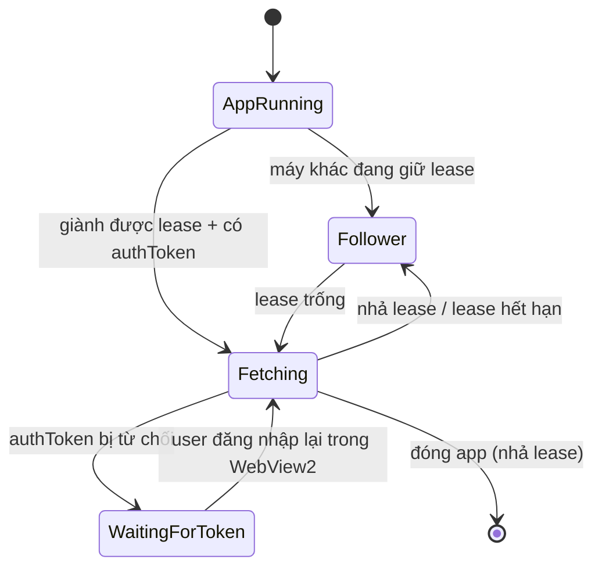

# AutoJMS DataHub — Vòng đời fetch nền

Cập nhật 2026-08-23.

> **Tài liệu này trước đây mô tả một Windows Service (`AutoJMS.DataHub.Worker`) chưa từng được dựng.**
> Bản cũ đã được owner duyệt về nguyên tắc, nhưng kiến trúc thi hành sau đó chọn hướng khác: **fetch chạy
> trong chính process UI của AutoJMS**, không có service riêng, không có Named Pipe, không có
> `%ProgramData%\AutoJMS\DataHub\tokens.dat`, không có `WorkerAccessToken`, không có `worker_gateway` và
> không có RPC nào trong database.
>
> Lý do đổi hướng nằm ở [`datahub-deployment-options.md`](./datahub-deployment-options.md) §1–§2: tải fetch
> rất nhỏ (N=10.000 đơn ⇒ ~8 request/phút, dưới trần governor 12 in-flight), nên "ai fetch" là quyết định
> vận hành chứ không phải hiệu năng. Bỏ service đổi lấy: token JMS không bao giờ rời process sinh ra nó,
> không phải cài/nâng cấp/ACL một service, không phải phát credential DB cho máy trạm.
>
> Cái mất: **đóng AutoJMS là dừng fetch**. Dữ liệu vẫn nằm trên VPS và đọc lại được ngay khi mở app, nên
> đây là degraded chứ không phải mất dữ liệu. Nếu sau này nghiệp vụ đòi fetch 24/7 thì bản thiết kế
> service cũ vẫn còn giá trị — xem §5.
>
> Hợp đồng as-built: [`architecture/datahub-backend-design.vi.md`](./architecture/datahub-backend-design.vi.md).

## 1. Vòng đời đang chạy



- **Lease:** `POST /api/v1/sites/{siteId}/lease/{acquire,renew,release}`, bảng `site_fetch_leases`, TTL
  **120 giây** do server đặt (`LeaseState.LeaseDurationSeconds`). Client giữ `CurrentLeaderTerm` /
  `HasSiteLease` trong `DataHubClient`.
- **Nhịp:** timer 30 phút, 8h–23h30 (ULTRA). Ngoài giờ đó không fetch.
- **Đóng app đúng cách:** nhả lease để máy khác đoạt ngay, không phải chờ 120 giây.
- **Đường ĐỌC không phụ thuộc fetch:** `GET /projections/snapshot` + `GET /changes?after=` chỉ cần device
  token, nên máy không giữ lease (và máy không có authToken) vẫn xem được dashboard.

## 2. Hai điều kiện độc lập — vẫn phải tách

Đây là phần của bản cũ **còn nguyên giá trị** và **vẫn chưa làm**:

| Điều kiện | Cho phép làm gì | Phụ thuộc |
|---|---|---|
| License DataHub hợp lệ + device token | ĐỌC (snapshot, changes, hub) | **không** cần authToken JMS |
| authToken JMS hợp lệ + giữ lease | FETCH JMS rồi ingest | cần cả hai |

`FullStackOperation.cs` (~122) hiện gộp hai điều kiện: DataHub chỉ khởi động khi đã có authToken. Hệ quả
là máy chưa đăng nhập JMS thì không xem được dashboard, dù nó có toàn quyền đọc. Phải tách.

Phân biệt hai kiểu dừng — bản cũ gọi là PAUSE vs DRAIN-STOP, vẫn đúng:

- **Hết authToken ⇒ PAUSE fetch.** Ngừng gọi JMS; những gì đã fetch vẫn được đẩy lên
  (`POST /jms/ingest` chỉ cần device token, không cần authToken); giữ lease nếu vẫn còn hạn. User đăng
  nhập lại ⇒ tự chạy lại, không restart app.
- **Mất lease / license hạ BASE / device token bị revoke ⇒ DRAIN-STOP.** Ngừng phát request mới, huỷ an
  toàn cái đang bay, **không** ghi tiếp dưới lease đã mất. `TierRuntimePolicy` hạ BASE thì toàn bộ đường
  nền phải tắt.

## 3. Điều kiện fetch (CanFetch)

```
CanFetch =
    tier == ULTRA                     (TierRuntimePolicy.EnableBackgroundAutoSync)
    AND device_token_valid            (enroll thành công, chưa hết 24h)
    AND site_lease_held               (lease còn hạn, đã renew)
    AND jms_auth_token_valid          (32-hex từ WebView2)
    AND trong khung giờ 8h–23h30
```

"Có token" không đủ, và "có lease" cũng không đủ. Mất bất cứ mệnh đề nào thì dừng **trước** request kế,
không phải sau khi phát xong lô hiện tại.

## 4. Bảo mật — trạng thái thật

- ✅ **Token JMS không còn ghi plaintext ra đĩa.** `SettingsManager` đã ngừng ghi `lastAuthToken` vào
  `AutoJMS.json`, và key cũ bị strip ở lần save kế (`RemoveKnownSettings`, one-way migration). Token chỉ
  tồn tại trong phiên WebView2 lúc chạy. Đây là mục P0 của bản cũ, **đã đóng**.
- ✅ **Không phát credential database cho máy trạm.** PostgreSQL không publish port ra host; máy trạm chỉ
  có device token HTTP. Mục tiêu của `worker_gateway` đạt được mà không cần gateway.
- ⚠️ **`HeartbeatSupervisor` giữ license key thô trong bộ nhớ** (`LicenseApiService.cs:699,721,740`) để
  `VerifyLicenseSecureAsync` lại khi phiên rớt. Trong bộ nhớ, không ghi đĩa — chấp nhận được, nhưng phải
  mask trong mọi log (`first4…last4`).
- ⚠️ **`installer/inno/AutoJMS.iss:142` cấp `Permissions: users-modify` cho toàn `{app}`.** Velopack cần
  quyền này để tự cập nhật, nên với mô hình hiện tại (mọi thứ chạy dưới user thường) đây **không** phải
  privilege escalation. Nhưng nếu sau này có tiến trình chạy quyền cao đặt trong `{app}` thì nó trở thành
  lỗ escalation ngay — xem §5.

## 5. Nếu sau này cần fetch 24/7

Ba ràng buộc phải giữ, lấy từ bản thiết kế service cũ:

1. **Không dùng `LocalSystem`.** Dùng virtual service account (`NT SERVICE\...`), đủ quyền đọc token store
   và ra mạng LAN.
2. **Binary của tiến trình quyền cao phải nằm ngoài thư mục users-modify** — thư mục machine-wide riêng
   dưới `C:\Program Files\`, `Users` chỉ Read/Execute. Đặt trong `{app}` (đang users-modify) là
   privilege escalation.
3. **Token store machine-scoped, DPAPI LocalMachine, ACL chỉ Service SID + Administrators.** Named Pipe
   thì ACL khác: server là Service SID nhưng **client phải là user thường** của AutoJMS, nếu không thì
   không relay được token.

Và một câu hỏi phải trả lời trước khi cam kết: **authToken lấy ở process UI có dùng được từ một tiến
trình chạy tài khoản khác trên cùng máy không?** §1b của
[`datahub-token-pool-plan.md`](./datahub-token-pool-plan.md) cho thấy về mặt HTTP thì có — `JmsApiClient`
không seed cookie, không client cert, chỉ header `authToken` + bộ header hằng. Nhưng đó là suy luận từ
code phía client, chưa phải quan sát từ JMS.

## 6. Tiêu chí nghiệm thu (áp cho mô hình hiện tại)

1. Máy A giữ lease, tắt app → **máy B fetch được** sau khi lease hết hạn (≤120 giây), hoặc ngay lập tức
   nếu A nhả lease đúng cách.
2. authToken bị từ chối → **0 request JMS**, app vẫn chạy, dashboard vẫn đọc được.
3. User đăng nhập lại JMS → **fetch tự chạy lại**, không restart app.
4. License hạ BASE dù authToken còn hợp lệ → **tắt toàn bộ đường nền** (không sync, không tracking, không
   timer).
5. Mất mạng tới DataHub → dừng trước request kế (fail-closed), không fetch mù rồi mất dữ liệu.
6. Hai máy ULTRA cùng bật → **đúng một máy** gọi JMS nền tại một thời điểm.
7. Máy chưa đăng nhập JMS → **vẫn xem được dashboard** (đây là tiêu chí đang FAIL, xem §2).
